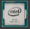
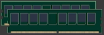
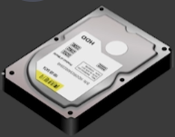

# Computer Hardware

<link rel="stylesheet" href="assets/my_style.css">

-----

## CPU 
-   CPU - 중앙처리장치
-   컴퓨터 성능 중 가장 빠른 부품
-   저장 불가 - 휘발성
-   메모리에서만 작업을 가져감

    

-----

## RAM
-   RAM - Memory
-   CPU의 개인 작업 공간 - 보조기억장치와의 갭을 줄이기 위함
-   전원을 종료하면 데이터가 사라짐

    

-----

## Hard Disk
-   HDD / SDD - 보조기억장치
-   (타 부품에 비해) 속도가 굉장히 느림

    

-----

## Main Board
-   PCB[^1]의 확장성에 따라 mother board라고 불림
-   주로 컴퓨터에서는 Mother board

[^1]: PCB ( Printed Circuit Board ) : 인쇄 회로 기판이라 부르는 PCB는 전자 부품을 인쇄 배선판의 표면에 고정하고 부품 사이 구리 배선으로 연결해 전자 회로를 구성한 판