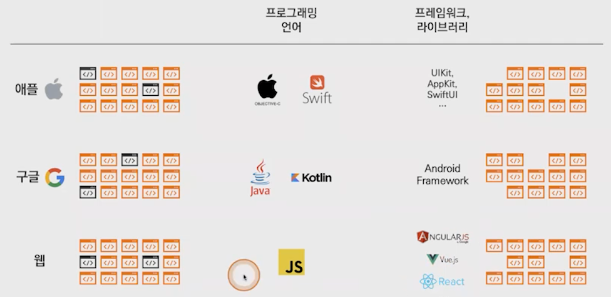
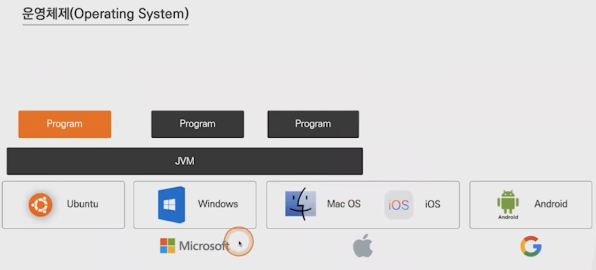
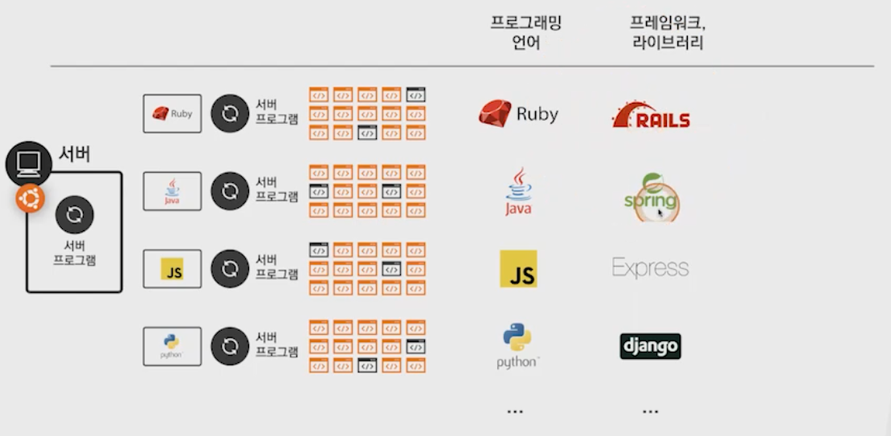

# Framework & Library
- 코드 덩어리들...

-----

## Framework
-   프레임워크 ( Framework ) : 이미 만들어진 기능(코드들의 집합)
    +   diff> 개발코드의 주도권이 코드에 있다면..
-   애플 같은 거대 기업들은 자신들의 스토어-앱스토어 에 많은 앱들을 등록할 수 있도록 장려하기 위해 프레임워크를 제공
    
-   웹 관련 프레임워크들은 회사나 개인들이 프레임워크, 라이브러리를 만들고 공유해서 업그레이드 해나감
     **Program on OS..**
     **Popular Frameworks..**

-----

## Library
-   라이브러리 ( Library ) : 이미 만들어진 기능(코드들의 집합) ??
    +   diff> 개발코드의 주도권이 개발자에게 있다면...