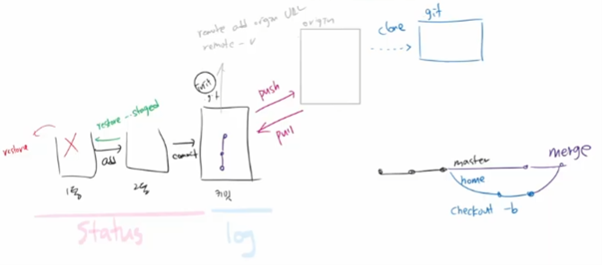

# DAY01-4

## Git branch
>   독립적인 작업흐름을 만들고 관리
---
```
(master) $git branch {branch name}
```
>   브랜치 생성
---
```
(master) $git checkout(switch) {branch name}
```
>   브랜치 이동
---
```
(master) $git checkout -b {branch name}
```
>   브랜치 생성 및 이동
---
```
(master) $git branch
```
>   브랜치 목록
---
```
(master) $git brach -d {branch name}
```
>   브랜치 삭제
---
## git merge case

1. fast forward
2. merge commit
    - ```git merge {branch name}``` 필요!
3. merge commit 충돌
    - conflic 발생!
---
## git PR(Pull Request) 현업

- Git Flow : Git을 활용하여 협업하는 흐름으로 branch를 활용하는 전략
- 기본 원칙
    1. master branch는 반드시 배포 가능한 상태여야 한다.
    2. feature branch는 각 기능의 의도를 알 수 있도록 작성한다.
    3. Commit message는 매우 중요하며, 명확하게 작성한다.
    4. Pull Request를 통해 협업을 진행한다.
    5. 변경사항을 반영하고 싶다면, merge를 진행한다.
- 진행
    1. git pull {branch}
    2. pull request
    3. review 후 merge

## git add / commit 복구 ( restore )


## @commit message tip!
Fix(수정) / Add(추가) / Remove(제거) / Use(특별한 무언가로 구현) / Refactor(전면수정) / Improve(향상) / Make(기존 동작의 변경) / ...
>   [출처](https://blog.ull.im/engineering/2019/03/10/logs-on-git.html)