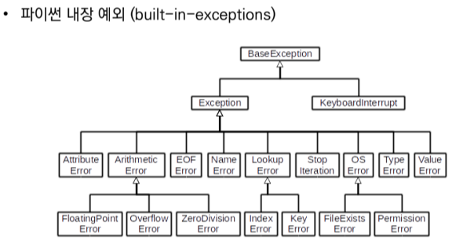

# Week02-4  
-   컬렉션 ( Collections ) 자료형

<br>[Parent Contents...](../../README.md/#til-today-i-learned)

## Contents
- [Dictionary](#Dictionary)
- [Module](#Module)
- [Error/Exception](#Error/Exception-Handling)
    + [Python Error](#Python-Error)
    + [Exception Handling](#Exception-Handling)
    + [Raise](#raise)

---

### Dictionary
-   사전 ( Dictionary ) : 키 - 값들의 모음
    - 키 ( key )    : 불변 자료형만 가능
    - 값 ( values)  : 어떠한 형태든 가능
-   키와 값은 :로 구분. 개별 요소는 ,로 구분
-   변경 가능하며( mutable ), 반복 가능( iterable )
-   딕셔너리에 키값 쌍을 추가 가능
-   이미 해당하는 키가 있다면 기존 값이 변경
```
students = {'홍길동': 100, '김철수': 90}
students['홍길동'] = 80
# {'홍길동': 80, '김철수' = 90}
students['박영희'] = 95
# {'홍길동': 80, '김철수' = 90, '박영희' = 95}
```

---

### Module
-   모듈 ( module ) : 다양한 기능( function )을 하나의 파일
-   패키지 ( package ) : 다양한 파일( module )을 하나의 폴더
-   라이브러리 ( library ) : 다양한 패키지( package )를 하나의 묶음
-   pip : 이것들의 관리자

---

### Error/Exception Handling

#### Python Error
-   디버깅 ( debugging ) : 에러/예외 처리 
-   문법 에러 ( Syntax Error )
-   EOL ( End of Line )
-   EOF ( End of File )
-   ZeroDivisionError : 0으로 나눌 때
-   NameError         : namespace 상에 이름이 없는 경우
-   TypeError         : 타입 불일치, arguments 부족
-   ValueError        : 타입이 올바르나 값이 적절하지 않은 경우
-   IndexError
-   KeyError
-   ModuleNotFoundError
-   ImportError
-   IndentationError   : for, if문 등 탭 에러
-   KeyboardInterrupt


#### Exception Handling
-   try 문( statement ) / except 절 ( clause )
    - try : 오류가 발생할 가능성이 있는 코드 실행
    - except : 예외가 발생하면 except 절 실행, 예외 상황을 처리하는 코드를 받아 적절한 조치
    - else : try에서 예외 발생하지으면 실행
    - finally : 예외 발생 여부와 상관없이 항상 실행

#### raise
-   raise statement : raise를 통해 예외를 강제로 발생
```
raise
# -------
# RuntimeError Traceback (most recent call last)
# ----> 1 raise
# RuntimeError: No active exception to reraise
```
-   assert : 특정 조건이 거짓이면 발생. 디버깅 및 테스트에서 활용