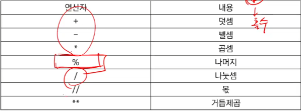
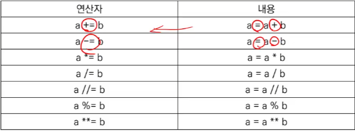
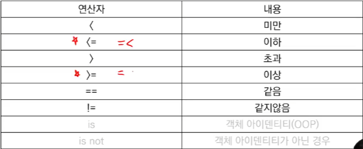
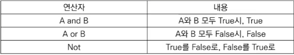
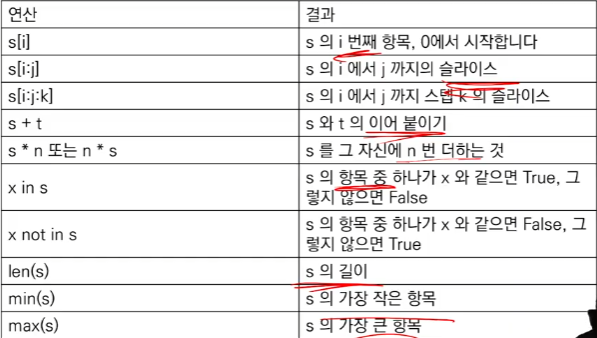
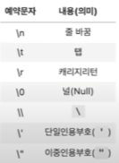

# Week02-1
-   Python ( variable type, operator, container )

<br>[Parent Contents...](../../../README.md/#til-today-i-learned)

## Contents
- [컴퓨터 프로그래밍 언어](#컴퓨터-프로그래밍-언어)
- [파이썬](#파이썬--python)
    + [변수 타입](#변수-타입)
    + [연산자](#연산자--operator)
    + [컨테이너](#시퀀스형-컨테이너--sequential-container)
    + [문자열](#문자열--string-type)
    + [리스트](#리스트)
    + [None](#none)

---

---

## 컴퓨터 프로그래밍 언어
-   컴퓨터 ( Computer ) - 조작 ( Calculation ) + 저장 ( Remember )
-   프로그래밍 ( Programming ) - 명령어 모음, 컴퓨터에게 명령하기 위한 약속
-   선언적 지식 ( Declarative Knowledge ) : 사실에 대한 내용
-   명령적 지식 ( Imperative Knowledge ) : How-to

---

## 파이썬 ( Python ) 

-   스크립트 ( Script ) 언어
-   Expressive Language : 같은 작업에 대해서도 C나 자바보다 더 간결하게 작성 가능
-   인터프리터 언어 ( Interpreter ) : 소스코드를 기계어로 변환하는 컴파일 과정 없이 바로 실행 가능, 코드를 입력하고 실행한 후 바로 확인할 수 있음
-   객체 지향 언어[^1]로만 이루어짐   
[^1]: 객체 지향 언어 ( Object Oriented Programming ) : 변수, 상수, 함수 등 값을 가진 것들의 집합

---

#### 변수 타입
-   수치형 ( Numeric Type )
    -   int / float / complex
    -   3.14 - 3.02 == 0.12 => ( False ) 3.14 - 3.02 == 0.1200000000001 이기 떄문
-   불린형 ( Boolean Type )
    -   True / False

---

#### 연산자 ( Operator )
-   사칙연산 및 수식 계산
<br>
<br>
<br>
<br>

---

#### 시퀀스형 컨테이너 ( Sequential Container )
-   <br>
-   문자열, 리스트
-   range, tuple, ...
#### 컬렉션형 컨테이너 ( Enumerating Container)
-   dictionary, set

---

#### 문자열 ( String Type )
-   작은 따옴표(')나 큰 따옴표(")로 표기
-   인덱스( Index )를 통해 접근 : s[1] => 'b'
-   문자열 연산자
    -   결합 ( Concatenation )
    ```
    'hello, ' + 'python!'
    # 'hello, python!'
    ```
    -   반복 ( Repetition )
    ```
    'hi!' * 3
    # 'hi!hi!hi!'
    ```
    -   포함 ( Membership )
    ```
    'a' in 'apple'
    # True
    'app' in 'apple'
    # True
    'b' in 'apple'
    # False
    ```
-   Escape sequence
<br><br>
```
print('철수 \'안녕 \'')
# 철수 '안녕'
print('이 다음은 엔터.\n그리고 탭\t탭')
# 이 다음은 엔터.
# 그리고 탭 탭
```
-   Immutable ( 변경 불가 ) / Iterable ( 반복 가능 ) 

---

#### 리스트
-   특정 타입 변수들의 나열
-   대괄호([]) 혹은 list() 를 통해 생성
    -   접근은 list[i]
-   값 추가 : .append()
    -   추가하고자 하는 ***값***
```
even_numbers = [2, 4, 6, 8]
even_numbers.append(10)
even_numbers
# => [2, 4, 6, 8, 10]
```
-   값 삭제 : .pop()
    -   삭제하고자 하는 ***인덱스***
```
even_numbers = [2, 4, 6, 8]
even_numbers.pop(0)
even_numbers
# => [4, 6, 8]
```
---

#### None
-   값이 없는 파이썬 자료형