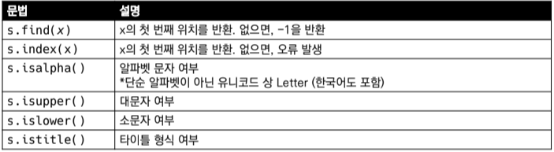
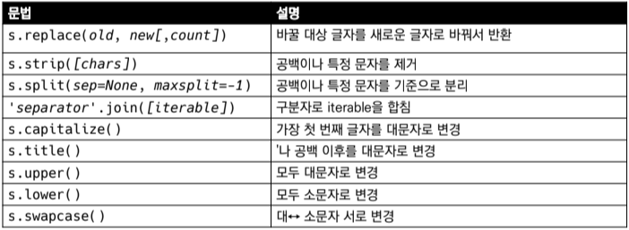
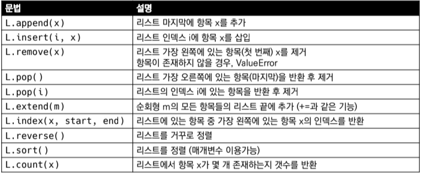
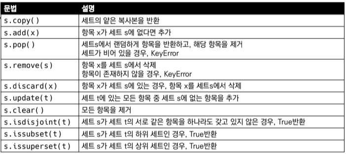
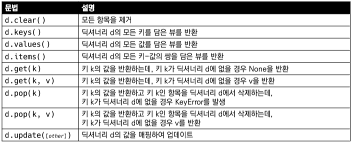

# Week03-1
-   메서드 ( Method )

<br>[Parent Contents...](../../../README.md/#til-today-i-learned)

## Contents
- [Tuple](#tuple)
- [Set](#set)
- [Data Type & Method](#data-type--method)
    + [String](#string-type)
    + [List](#list)
    + [Set](#set-1)
    + [Dictionary](#dictionary)
- [-----tips-----](#tips)
- [*map](#map)
- [python manual](#python-manual)
- [Sequence와 Collection](#sequence--collection)
---

## Tuple
-   튜플 ( Tuple ) : 불변한 값들의 나열
-   순서를 가지며, 서로 다른 타입의 요소 가질 수 있음
-   변경 불가능하며 ( immutable ), 반복 가능함 ( iterable )
    -   <-> 변경 가능한 ***list***
-   항상 소괄호 형태로 정의하며, 요소는 콤마로 구분 `(0, 1, 3)`
```
# 값 접근
a = (1, 2, 3, 1)
a[1]

# 값 변경 => 불가능
a[1] = '3'
```

---

## Set
-   Set : 유일한 값들의 모음 ( collection )
-   순서가 없고 중복된 값이 없음.
    -   수학에서의 집합과 동일한 구조, 집합 연산 가능
-   변경 가능하며 ( mutable ), 반복 가능함 ( iterable )
```
{1, 2, 3, 1, 2}
# {1, 2, 3}
type({1, 2, 3})
# <class 'set'>
blank_set = set()
```
```
{'hi', 1, 2}
# => {1, 2, 'hi'}
```
```
{1, 2, 3}[0]

# TypeError Traceback...
```
-   값 추가는 .add()
```
numbers = {1, 2, 3}
numbers.add(5)
numbers
# => {1, 2, 3, 5}
numbers.add(1)
numbers
# => {1, 2, 3, 5}
```
-   값 삭제는 .remove()
```
numbers = {1, 2, 3}
numbers.remove(1)
numbers
# => {2, 3}
numbers.remove(5)
# Traceback ...
# Key Error: 5
```

---

## Data Type & Method

### - String Type
-   문자열 탐색/검증

-   문자열 변경


### - List
-   리스트


### - Set
-   세트


### - Dictionary
-   딕셔너리

---

## Tips

### *map
-   map() : 요소를 지정된 함수로 처리해주는 함수

### Python Manual
-   [Python Manual](https://docs.python.org/ko/3/tutorial/datastructures.html#)에 등재된 데이터 구조

### Sequence & Collection
-   Sequence    : 순번이 부여된 데이터들의 집합
    >   string, list, tuple, range
    +   string  : 문자의 배열
    +   lsit    : 변경 가능한 데이터들의 나열
    +   tuple   : 변경 불가한 데이터들의 나열
    +   range   : ~~정해진 규칙을 가지고 있는 데이터들의 집합~~ <br>숫자의 나열
    <br><br>
-   Collection  : 순번이 없는 데이터들의 집합
    >   set, dictionary 
    +   set         : 중복 없는 값의 모음
    +   dictionary  : 키 값 쌍으로 이뤄진 모음