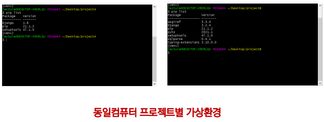
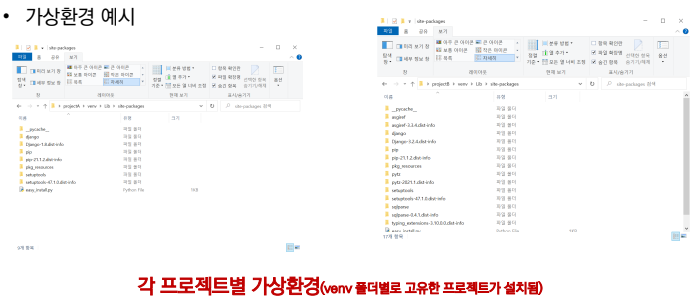

# Week03-5
-   API, 가상 환경

---

<br>[Parent Contents...](../../README.md/#til-today-i-learned)

## Contents
- [API](#api)

<br>

---

## API
-   API ( Application Programming Interface ) : 컴퓨터 프로그램 사이의 연결
-   일종의 소프트웨어 인터페이스[^1], 다른 종류의 소프트웨어에 서비스를 제공
-   사용하는 방법을 기술하는 문서나 표준은 API 사양/명세 (specification)
    +   요청하는 방식에 대한 이해
        *   인증 방식
        *   URL 생성
            -   기본 주소
            -   원하는 기능에 대한 추가 경로
            -   요청 변수 (필수와 선택)
    +   응답 결과에 대한 이해
        *   응답 결과 타입 (JSON)
        *   응답 결과 구조
>* https://search.naver.com/search.naver?query=카카오
>* <br>https://google.com/search?q=카카오
>* <br>https://ww.dhlottery.co.kr/common.do?method=getLottoNumber&drwNo=1049

[^1]: Interface : 장치 사이에 정보나 신호를 주고받는 접점이나 경계면

---

## Project
-   [TMDB](https://www.themoviedb.org/)의 API를 통한 실습 -> [API](https://developers.themoviedb.org/3)

---

## Virtual Envrironment
-   가상 환경 - from python ver.3.5
-   특정 디렉토리에 가상 환경 만들고 고유한 파이썬 패키지 집합
-   가상환경 생성하면, 해당 디렉토리에 별도의 파이썬 패키지 설치
    ```bash
    $python -m venv <폴더명>
    ```

-   가상환경 활성화
    |플랫폼|셸|가상 환경을 활성화하는 명령|
    | --- | --- | --- |
    |POSIX|bash/zsh|`$ source <venv> /bin/activate`|
    ||fish|`$ source <venv> /bin/activate.fish`|
    ||csh/tcsh|`$ source <venv> /bin/activate.sch`|
    ||PowerShell Core|`$ <venv> /bin/Activate.ps1`|
    |윈도우|cmd.exe|`C:\ <venv> \Scripts\activate.bat`|
    ||PowerShell|`PS C:\> <venv> \Scripts\Activate.ps1`|
    +   가상환경 비활성화는 `$ deactivate` 사용

    
    