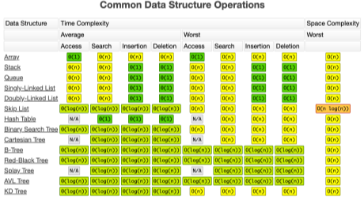
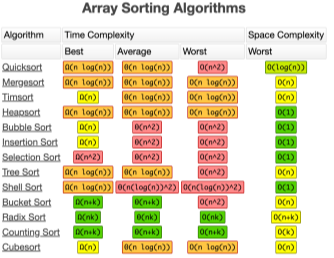

# Week04-2
-   Time Complexity & Big-O, List

-----

<br>[Parent Contents...](../../README.md/#til-today-i-learned)

## Contents
- [Time Complexity](#time-complexity)
    + [Big-O](#big-o)
- [List](#list)
    + [Array](#array)
    + [Linked List](#linked-list)

<br>

-----

## Time Complexity
-   시간 복잡도 ( Time Complexity ) - 계산 복잡도 이론에서 문제를 해결하는데 걸리는 시간과 입력의 함수 관계
-   CPU(시간)에 따라서 알고리즘마다 실행 시간이 다 다름
    +   -> 객관적인 측정을 위해 알고리즘 내부에서 <span style = "color:#FF5353;">기본연산 횟수</span> 수집
-   성능을 측정할 때는 입력을 통일시킴
-   가장 기본연산이 많이 일어나는 최악의 입력 n개가 들어옴

    1.  Sequence of statement
    ```python
    statement 1;
    statement 1;
    ...
    statement k;
    
    # 총 시간 = 시간(statement 1) + ... + 시간(statement k)
    ```
    

    2.  조건문 ( if )
    ```python
    if (조건):
        code block1;
    else:
        code block2;
    
    # 총 시간 = max(시간(code block1), 시간(code block2))
    ```

    3.  반복문 ( iterate )
    ```python
    for i in range(N):
        code block1;
    
    # 총 시간 = 시간(N) * 시간(code blcok1)
    ```
    ```python
    for i in range(N):
        for j in range(N):
            code block1;
    for k in range(N):
        code block2;
    
    # 총 시간 = 시간(N)**2 * 시간code block1) + 시간(N)
    ```

### Big-O
-   빅오 (Big-O) 표기법
: 입력 n 이 <span style = "color:#FF5353;">무한대</span>로 커진다고 가정하고 시간 복잡도를 간단하게 표시하는 것
<br> -> <span style = "color:#FF5353;">최고차항</span>만 남기고 계수와 상수 제거

>   `6n + 4` = O(n), `3n + 2` = O(n), `3`n^2^` + 6n + 1` = O(n^2^)

-   같은 Output을 만드는 알고리즘이라도
    <br>시간 복잡도에 따라 <span style = "color:#FF5353;">성능</span>이 달라질 수 있고
    <br>시험에서 <span style = "color:#FF5353;">정답 여부</span>가 갈리는 포인트가 된다는 것이다.

-   Big-O CheatSheet<br>
    
    
    
-----

## List

### Array
-   배열 ( Array ) : 여러 데이터들이 연속된 메모리 공간에 저장되어 있는 자료구조
    +   인덱스를 통해 데이터에 빠르게 접근
    +   배열의 길이는 변경 불가능 -> 길이를 변경하고 싶다면 새로 생성
    +   데이터 타입은 고정

### Linked List
-   연결 리스트 ( Linked List ) : 데이터가 담긴 여러 노드들이 순차적으로 연결된 형태의 자료구조
    +   맨 처음 노드부터 순차적으로 탐색
    +   연결리스트의 길이 자유롭게 변경 가능 -> 삽입, 삭제가 관리
    +   다양한 데이터 타입 저장
    +   데이터가 메모리에 연속적으로 저장되지 않음

### List Comprehension
-   리스트 초기화시 사용하면 가독성 증가 (+약간의 시간 단축?)
    ```python
    list = [num for num in range(10)]
    ```