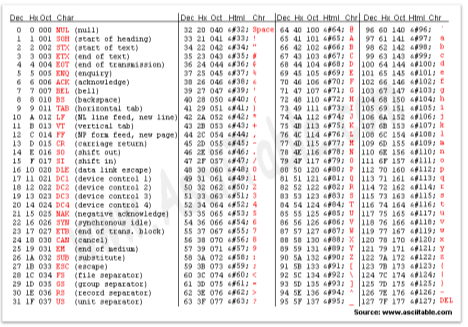

# Week04-3
-   String

-----

<br>[Parent Contents...](../../../README.md/#til-today-i-learned)

## Contents
- [String](#string)
- [String Slicing](#slicing)

<br>

-----

## String
-   문자열은 <span style="color:#FF5353">immutable</span>(변경 불가능한) 자료형!
    +   -> 문자열은 `.sort()` `.remove()` `.append()` `.pop()` 등 불가능
    ```python
    word = "apple"
    print(word)
    print(id(word))
    >>> apple
    >>> 1352749370800

    word += " banana"
    print(word)
    print(id(word))
    >>> apple banana
    >>> 1352749417520
    ```

-----

## Slicing
-   ```python
    s = 'abcdefghi'

    s[2:5]      # 'cde'
    s[-6:-2]    # 'defg'
    s[2:5:2]    # 'ce'
    s[2:5:-1]   # ''
    s[5:2:-1]   # 'fed'
    s[:3]       # 'abc'
    s[5:]       # 'fghi'
    s[:]        # 'abcdefghi'
    s[::-1]     # 'ihgfedcba'
    ```
-   정규표현식 (re, regular expression) : 파이썬 문자열 패턴일치 내장 모듈
    > [re - 정규식 연산 docs.python link..](https://docs.python.org/ko/3/library/re.html)

-----

## Method
-   `.split()`
:   문자열을 일정 기준으로 나누어 <span style="color:#FF5353">리스트</span>로 반환
-   `.strip()`
:   문자열의 양쪽 끝에 있는 <span style="color:#FF5353">특정 문자(default 공백)</span>를 모두 <span style="color:#FF5353">제거</span>한 새로운 문자열 반환
-   `.find(word)`
:   문자 찾고 <span style="color:#FF5353">인덱스</span> 반환, 없으면 <span style="color:#FF5353">-1</span>
-   `.index(word)`
:   문자 찾고 <span style="color:#FF5353">인덱스</span> 반환, 없으면 <span style="color:#FF5353">오류</span>
-   `.count(word)`
:   문자 <span style="color:#FF5353">갯수</span> 반환
-   `.replace(word1, word2, num)`
:   word1을 word2로 <span style="color:#FF5353">수정</span>한 새로운 문자열 반환, <span style="color:#FF5353">num 갯수만큼</span> replace
-   `.join(word)`
:   iterable의 각각 원소 사이에 특정 문자를 <span style="color:#FF5353">삽입</span>한 새로운 문자열 반환
-   `.startwith(word)`
:   word 단어로 <span style="color:#FF5353">시작</span>하는지 Bool
-   `.endwith(word)`
:   word 단어로 <span style="color:#FF5353">끝</span>나는지 Bool

-----

## ASCII code
-   ASCII ( American Standard Code for Information Interchange )
-   알파벳을 표현하는 대표 인코딩 방식
-   숫자만 이해할 수 있는 컴퓨터에게 문자를 이해시키기 위해 문자를 숫자화한 표
    +   각 문자를 표현하는데 1byte(8bits) 사용
        *   1 bit : 통신 에러 검출용
        *   7 bit : 문자 정보 저장 (총 128개)

    

-   파이썬 내장 함수
    +   `ord(word)` : <span style="color:#FF5353">문자 -> 아스키코드</span>로 변환하는 내장함수
    +   `chr(ASCII code)` : <span style="color:#FF5353">아스키코드 -> 문자</span>로 변환하는 내장함수