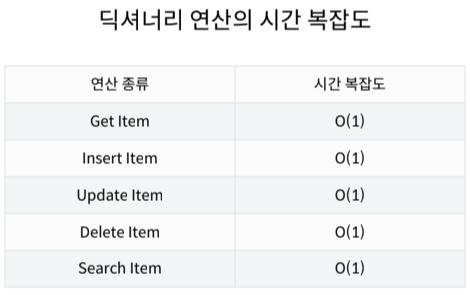

# Week04-4
-   Dictionary

-----

 [Parent Contents...](../../../README.md/#til-today-i-learned)

## Contents
- [Hash Table](#hash-table)
- [Dictionary 기본 문법](#dictionary-기본-문법)
- [Dictionary Method](#dictionary-method)

 

-----

## Hash Table
-   Dictionary - Non-sequence &  Key-Value
    +   Key는 Immutable(변경 불가능)
-   Hash Function : 임의 길이의 데이터를 고정 길이의 데이터로 매핑하는 함수
-   Hash : 해시 함수를 통해 얻어진 값
-   파이썬의 딕셔너리는 해시 함수와 해시 테이블을 이용하기 때문에 
 삽입, 삭제, 수정, 조회 연산의 속도가 리스트보다 빠르다.
  -> Hash function을 이용한 산술 계산으로 값이 있는 위치를 바로 알 수 있기 때문에

-   딕셔너리 사용 경우
    +   Key, Value 구조로 관리 해야하는 경우
    +   데이터에 대한 빠른 접근 탐색이 필요한 경우
    

-----

## Dictionary 기본 문법
-   선언        : `Variable = {key1: value1, key2: value2, ...}`
-   삽입/수정   : `Dictionary[key] = value`
-   삭제        : `Dictionary.pop(key, default)`
    +   없으면 default값 반환, default값 미지정 시 KeyError 발생
-   조회        : `Dictionary[key]` / `Dictionary.get(key, default)`
    +   없으면 default값(None) 반환

-----

## Dictionary Method
-   `.keys()` - key 목록이 담긴 dict_keys 객체 반환
-   `.values()` - value 목록이 담긴 dict_values 객체 반환
-   `.items()` - (key, value) 쌍 목록이 담긴 dict_items 객체 반환
