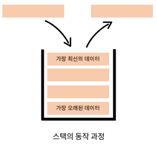
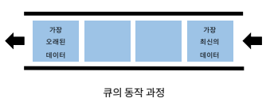
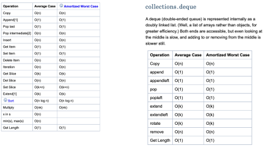

# Week05-1
- Stack, Queue

<link rel="stylesheet" href="../../css/my_style.css">

-   

-----

 [Parent Contents...](../../../README.md/#til-today-i-learned)

## Contents
- [Data Structure & Algorithm](#data-structure--algorithm)
- [Stack](#stack)
- [Queue](#queue)

 

-----

## Data Structure & Algorithm

-   Program = Data Structure + Algorithm
-   데이터 구조 ( Data Structure ) : 데이터를 다양한 방식으로 저장,  조회, 삽입, 변경, 삭제와 같은 조작 기능 제공
    +   -> 문제를 더 효율적으로 풀기 위한 도구

-----

## Stack

-   쌓는다는 의미로, 데이터를 한쪽에서만 넣고 빼는 자료구조
-   LIFO ( Last-in First-out, 후입선출) : 가장 마지막에 들어온 데이터가 가장 먼저 나감
    
-   push : 스택에 새로운 데이터 삽입하는 행위 
-   pop : 스택의 가장 마지막 데이터를 가져오는 행위
>   괄호 매칭, 함수 호출(재귀 호출), 백트래킹, DFS(깊이 우선 탐색)

-----

## Queue

-   한 쪽 끝에서 데이터를 넣고, 다른 한쪽에서만 데이터를 뺄 수 있는 자료구조
-   FIFO ( First-in First-out, 선입선출 ) : 가장 먼저 들어온 데이터가 가장 먼저 나감
    
-   enqueue : 큐의 맨 뒤에 데이터를 삽입하는 행위
-   dequeue : 큐의 맨 앞 데이터를 가져오는 행위
>   프로세스 관리(데이터 버퍼), 클라이언트/서버(Message Queue), BFS(너비 우선 탐색), 다익스트라 - 우선순위큐

### Deque

-   덱 ( Deque, Double-Ended Queue ) : 양 방향으로 삽입과 삭제가 자유로운 큐
-   삽입, 추출이 모두 큐보다 빠르다 -> 데이터의 삽입, 추출이 많은 경우, 시간을 크게 단축 시킬 수 있다.
    