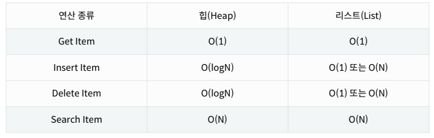
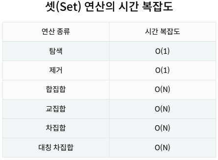

# Week05-2
- Heap, Set

<link rel="stylesheet" href="../../assets/stylesheets/my_style.css">

-   

-----

 [Parent Contents...](../../README.md/#til-today-i-learned)

## Contents
- [sample](#sample)

 

-----

## Priority Queue

-   우선순위 큐 ( Priority Queue ) : 우선순위를 기준으로 가장 운선순위가 높은 데이터가 먼저 나가는 방식
>   가중치가 있는 데이터, 작업 스케줄링, 네트워크
-   구현 방법
    +   배열 (Array)
    +   연결 리스트 (Linked List)
    +   힙 (Heap)

-----

## Heap

-   힙 ( Heap ) : 최대값 또는 초소값을 빠르게 찾아내도록 만들어진 데이터구조,
     완전 이진 트리의 형태로 느슨한 정렬 상태를 지속적으로 유지 한다.
-   중복값을 허용한다.
-   힙을 사용할 때
    +   데이터가 지속적으로 정렬되야 하는 경우
    +   데이터에 삽입.삭제가 빈번할때
-   파이썬의 heapq 모듈
    +   최소 힙(Minheap)으로 구현되어있음
    +   삽입, 삭제, 수정, 조회 연산의 속도가 리스트보다 빠름

     

-----

## Set

-   set : 수학에서 집합을 나타내는 데이터 구조
-   연산
    +   `.add()`
    +   `.remove()`
    +   `|` (합)
    +   `-` (차)
    +   `&` (교)
    +   `^` (대칭자)
-   Set을 사용할 때
    +   데이터의 중복이 없어야 할때
    +   정수가 아닌 데이터의 삽입/삭제/탐색이 빈번히 필요할 때 사용

     