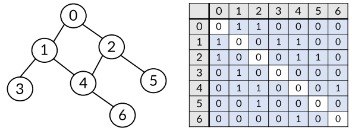
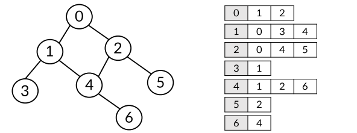

# Week06-4

-   Graph

<link rel="stylesheet" href="../../assets/stylesheets/my_style.css">

-----

 [Parent Contents...](../../README.md/#til-today-i-learned)

## Contents
- [Graph](#graph)
- [Graph Type](#graph-type)
- [Graph Representation](#graph-representation)

 

-----

## Graph

-   Graph : 정점(Vertex)와 이를 연결하는 간선(Edge)들의 집합으로 이루어진 비선형 자료구조

-   정점 ( Vertex ) : 간선으로 연결되는 객체, 노드(Node)라고도 불림
-   간선 ( Edge ) : 정점 간의 관계(연결)를 표현하는 선
-   경로 ( Path ) : 시작 정점부터 도착 정점까지 거치는 정점을 나열한 것
-   인접 ( Adjacency ) : 두 개의 정점이 하나의 간선으로 직접 연결된 상태

-----

## Graph Type

-   무방향 그래프 ( Undirected graph ) : 간선의 방향이 없는 그래프
    +   차수 ( Degree ) : 하나의 정점에 연결된 간선의 개수
    +   간선을 통해 양방향의 정점 이동 가능
    +   모든 정점의 차수의 합 = 간선 수 X 2

-   유방향 그래프 ( Directed graph ) : 간선의 방향이 있는 그래프
    +   간선의 방향이 가리키는 정점으로 이동 가능
    +   차수 ( Degree ) : 진입 차수와 진출 차수로 나누어짐

-----

## Graph Representation

-   인접 행렬 ( Adjacent matrix ) : 간선이 있으면 1, 없으면 0으로 표현되는 행렬

    

-   인접 리스트 ( Adjacent list ) : 리스트를 통해 인접 정점들을 순차적으로 표현

    