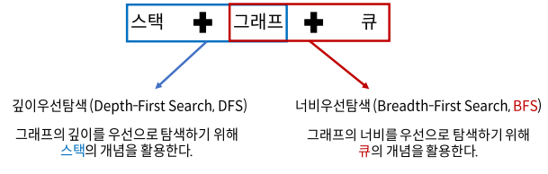
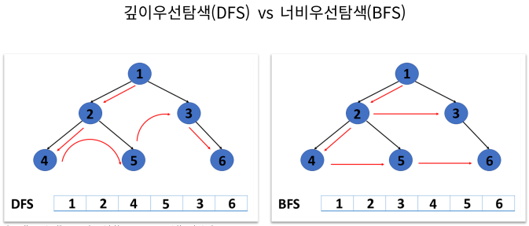
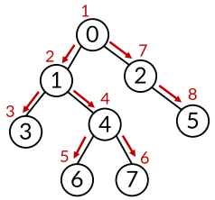

# Week07-1
<link rel="stylesheet" href="../../css/my_style.css">

- DFS

-----

<br>[Parent Contents...](../../../README.md/#til-today-i-learned)

## Contents
- [sample](#sample)

<br>

-----

## DFS

-   깊이우선탐색 ( DFS ) : 그래프 탐색 알고리즘, 시작 정점에서 <span>간선을 타고 이동할 수 있는 모든 정점을 찾는</span> 알고리즘

    
    

-   DFS 순회 방법

    

-   각 정점을 방문했는지 여부를 판별할 방문 체크 리스트 필요

    ```python
    visited = [False] * n # n을 정점의 개수
    ```