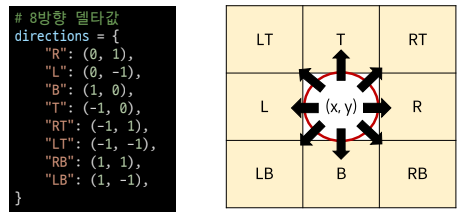

# Week07-2

-   Algorithm Implementation

<link rel="stylesheet" href="../../assets/stylesheets/my_style.css">

-----

 [Parent Contents...](../../README.md/#til-today-i-learned)

## Contents
- [sample](#sample)

 

-----

## Implementation

-   단순 구현 ( Implementation ) : 문제에 제시된 풀이 과정을 그대로 구현
-   델타 탐색 ( Delta Search )

    