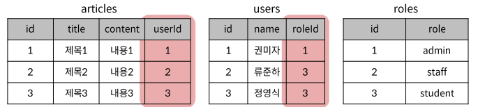
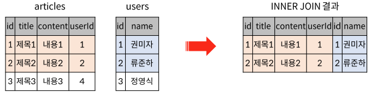
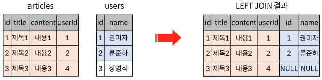
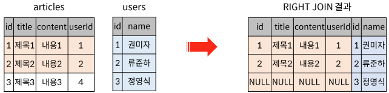
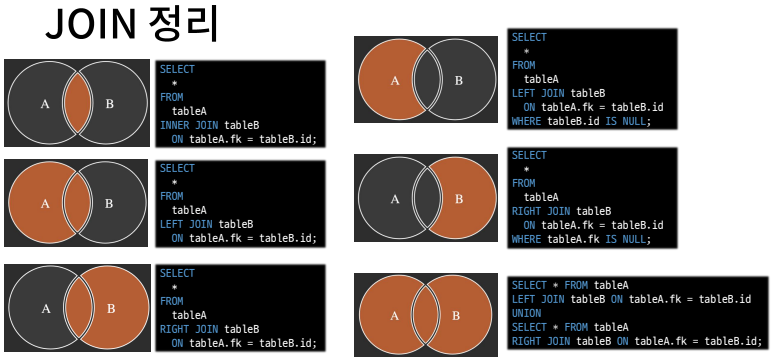

# Week08-3

-   Multi Table Queries


<link rel="stylesheet" href="../../assets/stylesheets/my_style.css">

<br>[Parent Contents...](../../README.md/#til-today-i-learned)

<br>

-----

## Join

-   나눠진 테이블의 관계 표시가 필요

    

-   <span>JOIN</span> clause
    +   INNER JOIN
    +   OUTER JOIN
        *   LEFT JOIN
        *   RIGHT JOIN
    +   CROSS JOIN

-   <span>INNER JOIN</span> syntax : 두 테이블에서 값이 일치하는 레코드에 대해서만 결과를 반환
    ```sql
    /*
    FROM절 이후 메인 테이블 지정(table1)
    INNER JOIN절 이후 메인 테이블과 조인할 테이블을 지정(table2)
    ON 키워드 이후 조인 조건을 작성
    */
    SELECT
        select_list
    FROM
        table1
    INNER JOIN table2
        on table1.fk = table2.pk;
    ```
    

-   <span>LEFT JOIN</span> clause : 오른쪽 테이블의 일치하는 레코드와 함께 왼쪽 테이블의 모든 레코드 반환
    ```sql
    /*
    FROM절 이후 왼쪽 테이블 지정(table1)
    LEFT JOIN절 이후 오른쪽 테이블 지정(table2)
    ON 키워드 이후 조인 조건을 작성
    */
    SELECT
        select_list
    FROM
        table1
    LEFT [OUTER] JOIN table2
        ON table1.fk = table2.fk;
    ```
    

-   <span>RIGHT JOIN</span> clause : 왼쪽 테이블의 일치하는 레코드와 함께 오른쪽 테이블의 모든 레코드 반환
    ```sql
    /*
    FROM절 이후 왼쪽 테이블 지정(table1)
    LEFT JOIN절 이후 오른쪽 테이블 지정(table2)
    ON 키워드 이후 조인 조건을 작성
    */
    SELECT
        select_list
    FROM
        table1
    RIGHT [OUTER] JOIN table2
        ON table1.fk = table2.fk;
    ```
    

-   JOIN 정리

    