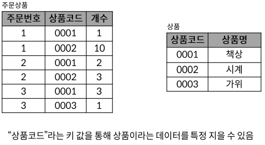

# Week09-2

-   SQL - Advanced 02

<link rel="stylesheet" href="../../assets/stylesheets/my_style.css">

 [Parent Contents...](../../README.md/#til-today-i-learned)

-----

## Normalization

-   정규화 ( Normalization ) : RDB 설계 단계에서 중복을 최소화하여 데이터를 구조화하는 과정

    

1.  **제 1 정규화**
    -   데이터베이스의 각 필드에는 하나의 값만 저장해야 함
    -   유사하게 정보를 저장하는 두 개의 필드가 있어서는 안됨

        
        

2.  **제 2 정규화**
    -   키 값을 이용해 데이터를 특정 지을 수 있는 것(함수 종속성)을 찾아 테이블을 분할

        
        

3. **제 3 정규화**
    -   기본 키 이외의 부분에서 중복이 없는 지를 조사하여 테이블을 분할

        

-  제 3 정규화까지의 결과

    

-   제 4 정규화, 제 5 정규화

-   정규화 목적
    +   "데이터를 쉽게 관리하기 위해"
    +   하나의 데이터를 무조건 한 곳에만 위치
    +   테이블 간의 관계는 키를 통해 표시
    +   데이터를 변경하더라도 한 곳만 변경하는 구조 확립

-----

## Data Modeling

-   데이터베이스 시스템을 시각적으로 표현하는 프로세스

### ER Diagram

-   ERD ( Entity-Relationship Diagram ) : 다이어그램을 사용하여 데이터베이스의 Entity 간 관계를 나타내는 방법

    

-   ERD 구성 요소

    

###  Relationship 표현 방법

-   Cardinality(기수) & Optionality(선택 가능성)

    

-   Cardinality
    +   1:1 관계
    +   1:N 관계
    +   M:N 관계

-   Optionality
    +   회원과 작성글 사이의 1:N 관계
    +   -> 회원과 글은 1:N이며, 글은 필수적으로 회원은 연결되어야 하지만 회원은 선택적으로 글과 연결될 수 있음

-   ERD 작성 결과
    

-   데이터 모델링의 중요성
    +   데이터베이스 소프트웨어 개발 오류 감소
    +   데이터베이스 설계 및 생성 속도와 효율성 촉진
    +   조직 전체에서 데이터 문서화 및 시스템 설계의 일관성 좃ㅇ
    +   데이터 엔지니어와 비즈니스 팀 간의 커뮤니케이션 촉진