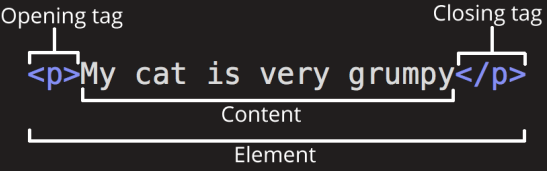
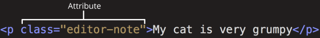
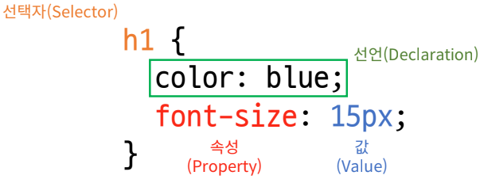
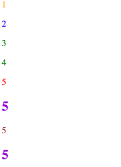

# Week09-3

-   Fundamentals of HTML and CSS


<link rel="stylesheet" href="../../assets/stylesheets/my_style.css">

<br>[Parent Contents...](../../README.md/#til-today-i-learned)

-----

## Web page

-   WWW, World Wide Web : 인터넷으로 연결된 컴퓨터들의 거대 정보 공유 공간
-   Web site : 인터넷에서 여러 Web page가 모인 것, 사용자에게 정보나 서비스를 제공
-   Web page : HTML, CSS, JavaScript 등의 웹 기술을 이용하여 만들어진, 인터넷 문서
-   구성 : HTML(Structure), CSS(Styling), Javascript(Behaviour)


----


## HTML

-   HTML ( HyperText Markup Language ) : 웹페이지의 의미와 구조를 정의하는 언어
-   HyperText : 웹 페이지를 다른 페이지로 연결하는 링크, 참조 텍스트
-   Markup Language : 태그 등을 이용하여 문서나 데이터의 구조를 명시하는 언어
    >  HTML, Markdown

```html
<h1>HTML</h1>
<p>HTML이란 Hyper Text Markup Language 의 약자이다.</p>

<h2>Hyper Text.</h2>
<p>Hyper Text란 ... </p>
<p>본문 : 이러한 Hyper Text 는 ...</p>

<h2>구글 효과(Google effect).</h2>
<p>구글 효과란...</p>
```

-   HTML Element
    
    +   닫는 태그가 없는 태그도 존재
<br><br>

-   HTML Attributes
    
    +   요소 이름 다음에 바로 오는 속성은 요소 이름과 속성 사이에 공백이 있어야 함
    +   하나 이상의 속성들이 있는 경우엔 속성 사이에 공백으로 구분함
    +   속성 값은 열고 닫는 따옴표로 감싸야 함
    +   CSS가 해당 요소를 선택하기 위한 값으로 활용
    
-   HTML 구조
    +   `<!DOCTYPE html>` : 해당 문서가 html로 문서라는 것을 나타냄
    +   `<html></html>` : 전체 페이지의 콘텐츠를 포함
    +   `<title></title>` : 브라우저 탭 및 즐겨찾기 시 표시되는 제목으로 사용
    +   `<head></head>` : HTML 문서에 관련된 설명, 설정 등, 사용자에게 보이지 않음
    +   `<body></body>` : 페이지에 표시되는 모든 콘텐츠

-   HTML Text tag
    +   `<h1></h1>` : 해당 <span>문서의 최상위 제목</span>
    +   Heading : h1~6
    +   Paragraphs : p
    +   Lists : ol, ul, li
    +   Emphasis & Importance : em, strong


-----


## CSS

-   CSS ( Cascading Style Sheet ) : 웹 페이지의 디자인과 레이아웃을 구성하는 언어

    

### CSS Style

-   Inline
```html
<h1 style="color: blue; background-color: yellow;">Hello World!</h1>
```

-   Internal
```html
<head>
    ...
    <style>
        h1 {
            color: blue;
            background-color: yellow;
        }
    </style>
    ...
</head>
<body>
    <h1>Hello WOrld!</h1>
    ...
```

-   External
```html
<!DOCTYPE html>
...
<head>
    ...
    <link rel="stylesheet" href="style.css">
    ...
<body>
    <h1>Hello World!</h1>
    ...
```
```css
/* style.css */

h1 {
    color: blue;
    background-color: yellow;
}
```

### Select elements

-   CSS Selectors : HTML 요소를 선택하여 스타일을 적용할 수 있도록 함
-   기본 선택자
    +   전체(*) 선택자
    +   요소(tag) 선택자
    +   클래스(class) 선택자
    +   아이디(id) 선택자   <span>문서 내에서 한번 등장할 스타일</span>
    +   속성(attr) 선택자

-   결합자 (Combinators)
    +   자손 결합자 (""(space))
    +   자식 결합자 (>)     <span>only 직계</span>

### Cascade & Specificity

-   동일한 요소에 적용 가능한 같은 스타일을 두 가지 이상 작성 했을 때 어떤 규칙이 이기는지 결정하는 것

-   Cascade (계단식) : 동일한 우선순위를 가지는 규칙이 적용될 때 CSS에서 마지막에 나오는 규칙이 사용
    ```css
    h1 {
        color: red;
    }

    h1 {
        color: blue;
    }
    /* result : h1에 blue 적용!*/
    ```

-   Specificity ( 우선순위 ) : 선택자 별로 정해진 우선순위 점수에 따라 점수가 높은 규칙이 사용
    +   Importance -> `!important` : Cascade의 구조를 무시하고 모든 우선순위 점수 계산을 무효화하는 가장 높은 우선순위. 사용하지 않는것이 권장됨.
    +   우선순위 : 인라인 스타일 > id 선택자 > class 선택자 > 요소 선택자
    +   소스 코드 순서

    ```html
    <p>1</p>
    <p class="blue">2</p>
    <p class="blue green">3</p>
    <p class="green blue">4</p>
    <p id="red" class="blue">5</p>
    <h2 id="red" class="blue">6</h2>
    <p id="red" class="blue" style="color: brown;">7</p>
    <h2 id="red" class="blue" style="color: brown;">8</h2>
    ```
    ```css
    h2 {
        color: darkviolet !important;
    }

    p {
        color: orange;
    }

    .blue {
        color: blue;
    }

    .green {
        color: green;
    }

    #red {
        color: red;
    }
    ```

    

-   상속 : 부모의 스타일 속성은 자식에게 그대로 상속됨
    +   상속 되는 속성 : Text 관련 요소(font, color, text-align), opacity, visibility 등
    +   상속 되지 않는 속성 : Box model 관련 요소(width, height, margin, padding, border, box-sizing, display), position 관련 요소(position, top/right/bottom/left, z-index) 등


-----


## Tips

-   HTML 관련 사항
    +   HTML 요소 이름은 대소문자 구분하지 않지만 <span>소문자 사용 권장</span>
    +   HTML 속성의 따옴표는 작은 따옴표와 큰 따옴표를 구분하지 않지만 <span>큰 따옴표</span> 권장
    +   HTML은 프로그래밍 언어와 달리 <span>에러를 반환하지 않음</span>
<br><br>

-   CSS 인라인 스타일 사용 자제할 것
    +   문서 유지보수가 힘듬
    +   CSS와 HTML 구조 정보가 혼합되어 코드 이해가 어려워짐
<br><br>

-   속성은 class만 사용하도록 함
    +   id, 요소 선택자 등과 함께 사용할 경우 우선순위 규칙에 따라 유지보수가 어려워 질 수 있음
    +   문서에서 단 한번 유일하게 적용될 스타일에 경우에 id 선택자 사용
<br><br>

-   CSS 상속 여부는 MDN 문서에 명시