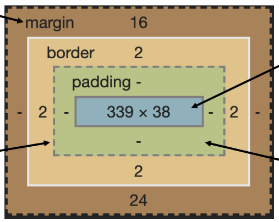
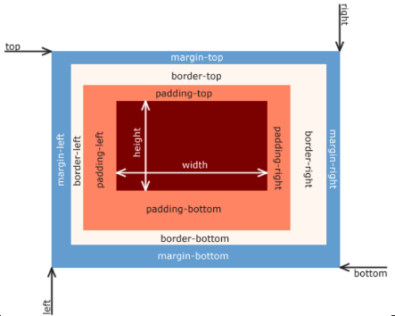

# Week09-4

-   


<link rel="stylesheet" href="../../assets/stylesheets/my_style.css">

<br>[Parent Contents...](../../README.md/#til-today-i-learned)

-----


## Box Model

- 모든 HTML 요소를 (사각형) 박스로 표현
  + <span>박스에 대한 크기, 여백, 테두리 등의 스타일을 지정하는 디자인 개념</span>


-----


## Box의 Components

- 박스의 구성

  
  + Margin : 이 박스와 다른 요소 사이의 공백 가장 바깥쪽 영역
  + Border : 콘텐츠와 패딩을 감싸는 테두리 영역
  + Padding : 콘텐츠 주위에 위치하는 공백 영역
  + Content : 콘텐츠가 표시되는 영역

  

- Box-sizing 속성 : 요소의 너비와 높이를 계산하는 방법을 지정
  ```css
  * {
    /* box-sizing: content-box;  default값*/
    box-sizing: border-box;
  }
  ```


-----


## Box Type

- Block & Inline
  + Block : Top to Bottom
  + Inline : Left to Right

- Block
  + 항상 새로운 행으로 나뉨
  + width와 height 속성을 사용하여 너비와 높이 지정할 수 있음
  + 기본적으로 width 속성을 지정하지 않으면 박스는 inline 방향으로 사용 가능한 공간은 모두 차지함
  + > h1~6, p, div

- Inline
  + 새로운 행으로 나뉘지 않음
  + width와 height 속성을 사용할 수 없음
  + 수직 방향 - padding, margins, borders가 적용되지만 다른 요소를 밀어낼 수는 없음
  + 수평 방향 - padding, margins, borders가 적용되어 다른 요소를 밀어낼 수 있음
  + > a, img, span

- `display: inline-block`
  + inline과 block 요소 사이의 중간 지점을 제공하는 display 값
  + 요소가 줄 바꿈 되는 것을 원하지 않으면서 너비와 높이를 적용하고 싶은 경우에 사용
  + block 요소의 특징을 가짐
    * 너비 및 높이 속성이 준수
    * 패딩, 여백 및 테두리로 인해 다른 요소가 상자에서 밀려남
-----


## Tips

- Margin collapsing (마진 상쇄)
  + 두 block 타입 요소의 margin top과 bottom이 만나 큰 margin으로 결합되는 현상
  + 웹 개발자가 레이아웃을 더욱 쉽게 관리할 수 있도록 함
    * -> 각 요소에 대해 상/하 margin을 각각 설정하지 않고 한 요소에 대해서만 설정할 수 있음

- shorthand 속성 - border
  ```css
  /* 순서는 영향을 주지 않음 */
  /* border-width, boder-style, border-color를 한번에 설정하기 위한 속성 */
  { border: 1px solid black; }
  ```
  
- shorthand 속성 - margin & padding
  ```css
  {
    /* 4개 - 상우하좌 */ 
    margin: 10px 20px 30px 40px;
    padding: 10px 20px 30px 40px;
  }

  {
    /* 3개 - 상/좌우/하 */ 
    margin: 10px 20px 30px;
    padding: 10px 20px 30px;
  }

  {
    /* 2개 - 상하/좌우 */ 
    margin: 10px 20px;
    padding: 10px 20px;
  }

  {
    /* 1개 - 공통 */ 
    margin: 10px;
    padding: 10px;
  }
  ```