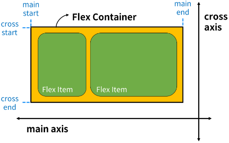

# Week10-2

-   CSS Layout


<link rel="stylesheet" href="../../assets/stylesheets/my_style.css">

<br>[Parent Contents...](../../README.md/#til-today-i-learned)

-----

## Float

- Float : 요소를 <span>띄워서</span> 텍스트 및 인라인 요소가 그 주위를 감싸도록 하는 배치
  + 띄우기 때문에 Normal flow에서 벗어남
  ```css
  .float-left {
    float: left;
  }

  .float-right {
    float: right;
  }
  ```

- inline-block 성질

- Float는 원래 탄생 목적에서 더 나아가 웹 페이저 전체 레이아웃을 구성하는 데 사용되었으나, <span>Flexbox</span>와 <span>Grid</span>의 등장으로 다시 원래의 목적으로 돌아감


-----


## Flexible box

- Flexbox : 요소를 행과 열 형태로 배치하는 1차원 레이아웃 방식, 반응형 레이아웃

  

- main axis (주 축)
  + flex item들이배치되는 기본 축
  + main start부터 main end 방향으로 배치

- cross axis (교차 축)
  + main axis에서 수직인 축
  + cross start에서 시작하여 cross end 방향으로 배치

  > 주축과 교차축은 가로, 세로가 아님! -> 주축과 교차축 교환 가능

- Flex Container
  + display: `flex;` 혹은 `display: inline-flex;`가 설정된 부모 요소
  + 이 컨테이너의 1차 자식 요소들이 Flex Item이 됨
  + flexbox 속성 값들을 사용하여 자식 요소 Flex Item들을 배치

- Flex Item
  + Flex Container 내부에 레이아웃 되는 항목

### attribute
- Flex Container 지정

- **배치 설정**
  + flex-direction 지정
    * flex item이 나열되는 방향 지정
    * column으로 지정할 경우 주 축 변경
    * -reverse 지정시 시작 선과 끝 선이 바뀜
  + flex-wrap
    * 다른 행에 배치 여부

- **공간 분배**
  + <span>justify</span>-content
    * <span>주축</span>을 따라 flex item과 주위 공간 분배
  + <span>align</span>-content
    * <span>교차축</span>을 따라 flex item과 주위에 공간 분배
    * flex-wrap이 wrap 또는 wrap-reverse로 설정된 여러 행에만 적용
    * 한줄 짜리 행에는(`flex-wrap: nowrap;`) 효과 없음
  + components
    * flex-start
    * flex-end
    * center
    * space-between
    * space-around
    * space-evenly

- **정렬**
  + align-<span>items</span>
    * 교차 축을 따라 flex item 행을 정렬
    * <span>행 하나</span> 정렬
  + align-<span>self</span>
    * 교차 축을 따라 개별 flex item을 정렬
    * <span>요소 하나</span> 정렬
  + components
    * stretch
    * flex-start
    * flex-end
    * center

- flex-grow
  + 남는 행 <span>여백</span>을 비율에 따라 각 flex item에 <span>분배</span>
  + flex-shrink : 넘치는 너비를 <span>분배</span>해서 줄임

- flex-basis
  + flex item의 초기 크기 값을 지정
  + flex-basis와 width 값을 동시에 적용한 경우 flex-basis가 우선


-----


## Tips

- 더미 데이터
  ```html
  <body>
    <p>lorem</p>
    <p>lorem100</p> <!-- 단어 100개 -->
  </body>
  ```

### Shorthand

- flex-flow
  ```css
  .container {
    flex-flow: flex-direction flex-wrap;
  }
  ```

- flex
  ```css
  .container {
    /* One value, unitless number: flex-grow */
    flex: 2;

    /* One value, length or percentage: flex-basis */
    flex: 10rem;
    flex: 30%;

    /* Two values: flex-grow | flex-basis */
    flex: 1 30px;

    /* Two values: flex-grow | flex-shirnk */
    flex: 2 2;

    /* Three values: flex-grow | flex-shrink | flex-basis */
    flex: 2 2 10%;
  }