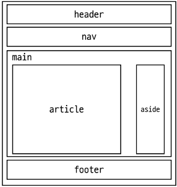

# Week10-3

-   Semantic Web


<link rel="stylesheet" href="../../assets/stylesheets/my_style.css">

<br>[Parent Contents...](../../README.md/#til-today-i-learned)

-----

## Semantic Web

- Semantic Web : 웹 데이터를 의미론적으로 표현하고 연결하는 개념
- 중점 - 요소의 시각적 표현 -> 요소가 가진 목적과 역할
- ex) 페이지의 최상위 제목
  + `<h1>Heading</h1>`
  <br>페이지 최상위 제목 의미를 제공하는 semantic 요소 h1
  브라우저에 의해 제목처럼 보이도록 큰 글꼴로 스타일이 지정됨

  +  `<span style="font-size: 32px;">Heading</span>`
  <br>요소를 최상위 제목'처럼' 보이게하나 의미론적 의미 없음

- 각 언어의 의미
  + HTML : 채워질 데이터를 나타내기 위함
  + CSS : 어떻게 보여야 하는지
  + Javascript : 어떻게 사용자와 상호작용하는지


-----


## Semantics in HTML

- HTML Semantic Element : 기본적인 모양과 기능 이외에 의미를 가지는 HTML 요소
  + 검색엔진 및 개발자가 웹 페이지의 콘텐츠를 이해하기 쉽게 만들어줌

- semantic element
  + header
  + nav
  + main
  + article
  + section
  + aside
  + footer
  > div - 대표적인 non-semantic 태그

  

* `<b>` 태그와 다르게 `<strong>` 태그는 웹 페이지 읽기 기능 시 발음이 강조되는 효과가 있음


-----


## Semantics in CSS

- OOCSS ( Object-Oriented CSS ) : 객체 지향적 접근법을 적용하여 CSS를 구성하는 방법론

- BEM ( Block Element Modifier ) : 블록, 요소, 수정자를 사용해 클래스 이름을 구조화하는 방법론
  ```css
  .block {}
  .block__element {}
  .block_modifier {}
  ```

- Block
  + 문단 전체에 적용된 요소 또는 요소를 담고 있는 컨테이너
  + 재사용 가능한 독립적 블록, 가장 바깥쪽 상위요소
  + 재사용을 위해 margin 또는 padding을 적용하지 않음
- Element
  + block이 포함되고 있는 한 조각
  + 블록을 구성하는 종속적인 하위요소
- Modifier
  + block 또는 element의 속성


-----


## Tips

- 검색 엔진 최적화 ( Search Engine Optimizer ) : 포털 사이트에 스크롤링 되기 용이하게 웹 사이트의 최적화된 형태

- Web developer - View outline을 통해 웹의 간단한 구조 확인 가능

- DRY ( Don't Repeat Yourself ) : 중복 배제 원리

- Emmet cheatsheet
  ```html
  div.wrapper>ul.list>li.item.item-$*5>a{link $}
  
  <div class="wrapper">
  <ul class="list">
    <li class="item item-1"><a href="">link 1</a></li>
    <li class="item item-2"><a href="">link 2</a></li>
    <li class="item item-3"><a href="">link 3</a></li>
    <li class="item item-4"><a href="">link 4</a></li>
    <li class="item item-5"><a href="">link 5</a></li>
  </ul>
</div>
  ```