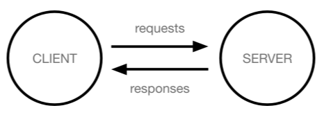
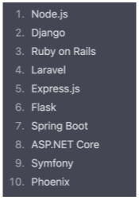

# Week13-1

-   Django - Understanding Django and framework


<link rel="stylesheet" href="../../assets/stylesheets/my_style.css">

<br>[Parent Contents...](../../README.md/#til-today-i-learned)


## Contents
- [sample](#sample)

<br>


-----


## Framework

- Framework : 웹 애플리케이션을 빠르게 개발할 수 있도록 도와주는 도구
  + 개발에 필요한 기본 구조, 규칙, 라이브러리 등을 제공 -> 필수적인 개발에만 집중 가능
  + 개발 속도 향상
  + 유지 보수와 확장에 용이


-----


## Client & Server

- 모바일 혹은 컴퓨터로 웹 페이지를 열람할때 발생하는 일

  

- Client : 서비스를 요청하는 주체
  + 웹 사용자의 장치, 웹 브라우저

- Server : client의 요청에 응답하는 주체
  + 웹 페이지, 앱을 저장하는 컴퓨터


-----


## Django

- Django : python 기반의 대표적인 웹 프레임워크

- 2022 가장 인기있는 백엔드 프레임워크



> Spotify, Instagram, Dropbox, Delivery Hero 에 사용

- django project 생성
  1.  가상환경 생성
  2.  가상환경 활성화
  3.  django 설치
  4.  의존성 파일 생성(패키지 설치시마다 진행) - 설치한 파일 목록
    * `$ pip install -r requirements.txt` 를 통해 requirements.txt 내용 자동으로 패키지 설치
    <br>단, python 버전이 몇인지는 확인 불가, <span>README.md</span>에 명시할것

  ```python
  # 1. 가상환경(venv) 생성
  $ python -m venv venv

  # 2. 가상환경 활성화
  $ source venv/Scripts/activate

  # 3. django 설치
  $ pip install django==3.2.18

  # 4. 의존성 파일 생성
  $ pip freeze > requirements.txt
  ```

- django project 실행
  ```python
  $ django-admin startproject firstpjt .
  ```

- django 서버 실행
  ```python
  $ python manage.py runserver
  ```

- 가상환경 사용 이유
  + 의존성 관리 - 라이브러리 및 패키지를 각 프로젝트마다 독립적으로 사용 가능
  + 팀 프로젝트 협업 - 모든 팀원이 동일한 환경과 의존성 위에서 작업하여 버전간 충돌을 방지

- LTS ( Long-Term Support )
  + 프레임워크나 라이브러리 등의 소프트웨어에서 <span>장기간 지원되는 안정적인 버전</span>을 의미할 때 사용
  + 기업이나 대규모 프로젝트에서는 소프트웨어 업그레이드에 많은 비용과 시간이 필요하기 때문에 안정적이고 장기간 지원되는 버전이 필요