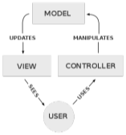
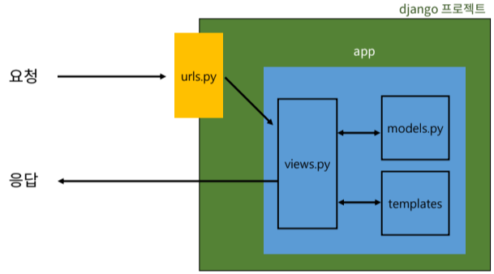
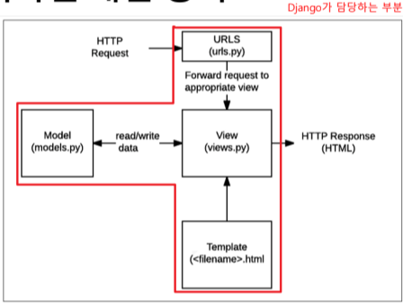

# Week13-2

-   Django - Design Pattern


<link rel="stylesheet" href="../../assets/stylesheets/my_style.css">

<br>[Parent Contents...](../../README.md/#til-today-i-learned)


## Contents
- [sample](#sample)

<br>


-----


## Django Project

- django project : 애플리케이션의 집합
  + DB 설정, URL 연결, 전체 앱 설정 등을 처리
    > 블로그 (전체 설정)

- django application : 독립적으로 작동하는 기능 모듈
  + 각자 특정한 기능을 담당, 다른 앱들과 함께 하나의 프로젝트를 구성
    > 게시글, 댓글, 카테고리, 회원 관리 등 (DB, 로직, 화면)

- 앱 생성
  ```python
  $ python manage.py startapp articles
  # 복수형 지정 권장
  ```


-----


## Design Pattern

- Design Pattern : 소프트웨어 설계에서 발생하는 문제를 해결하기 위한 일반적인 해결책
  + 공통적인 문제를 해결하는데 쓰이는 형식화 된 관행

- MVC 디자인 패턴 ( Model - View - Controller ) 
  + 애플리케이션을 구조화하는 대표적인 패턴
  + 데이터, 사용자 인터페이스, 비즈니스 로직을 분리
  + -> 시각적 요소와 뒤에서 실행되는 로직을 서로 영향 없이 <span>독립적</span>이고 쉽게 유지보수할 수 있는 애플리케이션을 만들기 위해

  

- MTV 디자인 패턴 ( Model - Template - View )
  + django에서 애플리케이션을 구조화하는 패턴
  + 기존 MVC 패턴과 동일하나 명칭을 다르게 정의
  + View -> Template / Controller -> View

### 프로젝트 구조

- settings.py
  + 프로젝트의 모든 설정을 관리

- urls.py
  + URL과 이에 해당하는 적절한 views를 연결

- __init__.py
  + 해당 폴더를 패키지로 인식하도록 설정

- asgi.py
  + 비동기식 웹 서버와의 연결 관련 설정

- wsgi.py
  + 웹 서버와의 연결 관련 설정

- manage.py
  + Django 프로젝트와 다양한 방법으로 상호작용 하는 커맨드라인 유틸리티


### 앱 구조

- admin.py
  + 관리자용 페이지 설정

- models.py
  + DB와 관련된 Model을 정의
  + MTV 패턴의 M

- views.py
  + HTTP 요청을 처리하고 해당 요청에 대한 응답을 반환 (url, mode, template과 연계)
  + MTV 패턴의 V

  


-----


## 요청과 응답

- URLs
  ```python
  # urls.py

  from django.contrib import admin
  from django.urls import path
  from articles import views

  urlpatterns = [
      path('admin/', admin.site.urls),
      path('articles/', views.index),
  ]
  ```

- View
  ```python
  # views.py

  from django.shortcuts import render

  def index(request):
    return render(request, 'articles/index.html')
  ```


-----


## Tips

### MTV 디자인 패턴

- Model
  + 데이터와 관련된 로직 관리
  + 응용프로그램의 데이터 구조를 정의하고 데이터베이스의 기록을 관리

- Template
  + 레이아웃과 화면을 처리
  + 화면상의 사용자 인터페이스 구조와 레이아웃을 정의

- Views
  + Model & Template과 관련한 로직을 처리해서 응답을 반환
  + 클라이언트의 요청에 대해 처리를 분기하는 역할
  > 데이터가 필요하다면 model에 접근해서 데이터를 가져옴 / 가져온 데이터를 template로 보내 화면을 구성 / 구성한 화면을 응답으로 만들어 클라이언트에게 반환

  


### Render

- `render(request, template_name, context)` : 주어진 템플릿을 컨텍스트 데이터와 결합하고 렌더링 된 텍스트와 함께 HttpResponse(응답) 객체를 반환하는 함수

- request : 응답을 생성하는데 사용되는 요청 개체
- template_name : 템플릿 이름의 경로
- context : 템플릿에서 사용할 데이터 (딕셔너리 타입으로 작성)