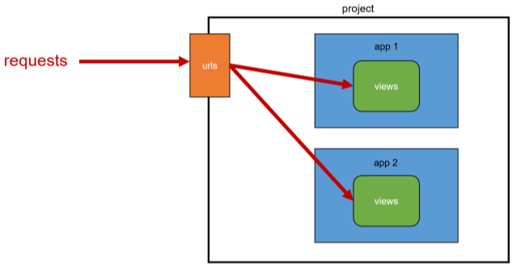

# Week13-4

-   Django - django URLs


<link rel="stylesheet" href="../../assets/stylesheets/my_style.css">

<br>[Parent Contents...](../../README.md/#til-today-i-learned)


## Contents
- [sample](#sample)

<br>


-----


## Introduction



- URL dispatcher<sup>운항 관리자, 분배기</sup>
  + URL 패턴을 정의하고 해당 패턴이 일치하는 요청을 처리할 view 함수를 연결(매핑)


-----


## Variable & URL

- Variable Routing[^1] : URL 일부에 변수를 포함시키는 것
  + 변수는 view 함수의 인자로 전달할 수 있음
  ```py
  urlpatterns = [
    path('articles/1/', ...),
    path('articles/2/', ...),
    path('articles/3/', ...),
    path('articles/4/', ...),
    path('articles/5/', ...),
    ...,
  ]
  ```
  ```py
  # <path_converter:variable_name>
  path('articles/<int:num>/', views.hello)
  path('hello/<str:name>/', views.greeting)
  ```

- Path converters : URL 변수의 타입을 지정
  + str, int 등 5가지 타입 지원 (+ slug, uuid, path)
  + model에서 DB호출 시 id 참고할때 주로 사용


[^1]: Routing : 네트워크에서 경로를 선택하는 프로세스


-----


## App의 URL

- App URL mapping : 각 앱에 URL을 정의하는 것
  + 프로젝트와 각각의 앱이 URL을 나누어 관리하여 주소 관리를 편하게 하기 위함

- `include()` : 다른 URL들을 참조할 수 있도록 돕는 함수
  + URL의 그 시점까지 일치하는 부분 잘라내고, 남은 문자열 부분 후속 처리를 위해 include된 URL로 전달


### URL 이름 지정

- Naming URL patterns : URL에 이름을 지정하는 것
  + path 함수의 name 인자를 정의해서 사용

- `url` tag : 주어진 URL 패턴의 이름과 일치하는 절대 경로 주소를 반환
  ```python
  
  ```


### URL Namespace

- 개요 - 서로 다른 앱의 url 이름이 같은 경우 이름만으로는 분리가 어려움

- app_name 속성 지정 - url + app 이름표 붙이기
  ```python
  # articles/urls.py

  app_name = 'articles'
  urlpatterns = [
    ...,
  ]
  ```
  ```python
  # pages/urls.py

  app_name = 'pages'
  urlpatterns = [
    ...,
  ]
  ```

- URL tag 변화
  + ` => 


-----


## Tips

- Django Trailing Slashes
  + URL 끝에 '/'가 없다면 자동으로 붙임
  + 기술적으로 `foo.com/bar` 와 `foo.com/bar/`는 서로 다른 URL이다.