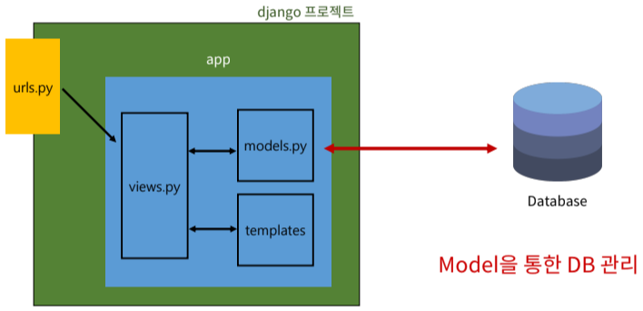

# Week13-5

-   Django - django Model


<link rel="stylesheet" href="../../assets/stylesheets/my_style.css">

<br>[Parent Contents...](../../README.md/#til-today-i-learned)


## Contents
- [sample](#sample)

<br>


-----


## Introduction



- SQLite : 오픈소스 RDBMS 중 하나이며 <span>django의 기본 DB</span>
  + DB가 <span>파일로 존재</span>하며 <span>가볍고 호환성이 좋음</span>


-----


## Model

- django Model : DB의 테이블을 정의하고 데이터 조작 기능 제공
  + 테이블 구조 설계하는 <span>청사진-blueprint</span>

  | id  | title | content |
  | :-----: | :-----: | :-----: |
  | .. | .. | .. |
  | .. | .. | .. |

  ```py
  # articles/models.py
  class Article(models.Model):
    # 필드 이름 / 데이터 타입(모델 필드 클래스) / 제약조건(모델 필드 클래스의 키워드 인자)
    title = models.CharField(max_length=10)  # 길이 제한을 줘야함
    content = models.TextField()    # 길이에 제한 없음
  ```

- Model 클래스 == Table 스키마

- django.db.models 모듈의 Model 부모 클래스를 상속 받아 작성

- 클래스 변수명 -> 테이블의 각 <span>필드 이름</span>

- model Field 클래스
  + 테이블 필드의 <span>데이터 타입</span>

- model Field 클래스의 키워드 인자 (필드 옵션)
  + 테이블 필드의 <span>제약 조건</span> 관련 설정


### Migrations

- Mirgrations : model 클래스의 변경사항(필드 생성, 추가 수정 등)을 DB에 <span>최종 반영</span>하는 방법

- Migrations 핵심 명령어
  + `$ python manage.py makemigrations`
  : model class를 기반으로 설계도(migration) 작성
  + `$ python manage.py migrate`
  : 만들어진 설계도를 DB에 전달하여 반영

- 필드 추가
  1. models.py에 추가
  ```py
  # articles/models.py
  class Article(models.Model):
    title = models.CharField(max_length=10) 
    content = models.TextField() 
    ### 추가
    created_at = models.DateTimeField(auto_now_add=True)  
    # auto_now_add - 데이터가 처음 생성될 때만 자동으로 현재 날짜시간 저장
    updated_at = models.DateTimeField(auto_now=True)
    # auto_now - 데이터가 저장될때마다 자동으로 현재 날짜시간 저장
    ###
  ```
  2. `$ python manage.py makemigrations`
  3. 날짜의 경우 1번 options 선택 후 직접 기본값 설정, 필드의 기본값에 django가 설정한 기본 값 사용위해서 빈 값을 enter
  4. `$ python manage.py migrate`


-----


## Admin site

- Automatic admin interface
  + django는 추가 설치 및 설정 없이 자동으로 관리자 인터페이스를 제공
  + 데이터 관련 테스트 및 확인을 하기에 유용

- admin 계정 생성
  + `$ python manage.py createsuperuser`
  + email은 선택사항이므로 입력하지 않고 진행 가능

- admin에 모델 클래스 등록
  ```py
  # articles/admin.py

  from django.contrib import admin
  from .models import Article

  admin.site.register(Article)
  ```


-----


## Tips

- DB 초기화 (둘다 진행)
  + migration 파일 삭제
  + db.sqlite3 파일 삭제

- Migrations 기타 명령어
  + `$ python manage.py showmigrations`
    * migrations 파일들이 migrate 됐는지 안됐는지 여부를 확인하는 용도
    * [X] 표시가 있으면 migrate 완료되었음을 의미
  + `$ python manage.py sqlmigrate articles 0001`
    * 해당 migrations 파일이 SQL 문으로 어떻게 해석 되어 DB에 전달되는지 확인하는 용도