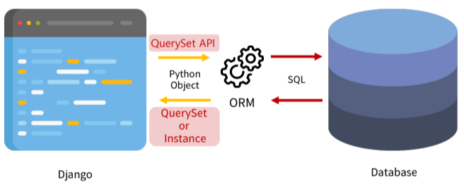

# Week14-1

-   Django - ORM


<link rel="stylesheet" href="../../assets/stylesheets/my_style.css">

<br>[Parent Contents...](../../README.md/#til-today-i-learned)


## Contents
- [sample](#sample)

<br>


-----


## Introduction



- ORM ( Object-Relational-Mapping ) 
: 객체 지향 프로그래밍 언어를 사용하여 호환되지 않는 유형의 시스템 간에 <span>데이터를 변환</span>하는 프로그래밍 기술


-----


## QuerySet API

- QuerySet API
: ORM에서 데이터를 검색, 필터링, 정렬 및 그룹화 하는데 사용하는 도구
  + API를 사용하여 SQL이 아닌 Python 코드로 데이터를 처리

- `Article.objects.all()`
  + Article - Model class
  + objects - Manager
  + all() - Queryset API

- Query
: DB에 특정한 데이터 요청
  + "쿼리문 작성" -> 원하는 데이터를 얻기 위한 코드 DB에 전송
  + 파이썬으로 작성한 코드가 ORM에 의해 SQL문으로 변환되어 DB에 전달, DB의 응답 데이터 또한 ORM이 변환하여 <span>QuerySet</span> 이라는 자료 형태로 사용자에게 전달

- QuerySet
: DB로부터 전달 받은 객체 목록(데이터 모음)
  + Django ORM을 통해 만들어진 자료형
  + 단, DB가 단일 객체 반환 할때는 QuerySet이 아닌 모델(Class)의 인스턴스로 반환함


-----


## ORM CREATE

- QuerySet API 실습 사전 준비
  + `$ pip install ipython`
  + `$ pip install django-extensions`
  ```py
  # settings.py

  INSTALLED_APPS = [
    'articles',
    'django_extensions',
  ]
  ```
  + `$ pip freeze > requirements.txt`

- Django shell
: django 환경 안에서 실행되는 python shell
  + 입력하는 QuerySet API 구문이 django 프로젝트에 영향을 미침

- 데이터 객체를 생성하는 방법
  1.  첫번째 방법
  ```py shell
  # 특정 테이블에 새로운 행을 추가하여 데이터 추가

  >>> article = Article()  # Article(class)로부터 article(instance)
  >>> article
  <Article: Article object (None)>

  >>> article.title = 'first' # 인스턴스 변수(title)에 값을 할당
  >>> article.content = 'django!' # 인스턴스 변수(content)에 값을 할당
  # save를 하지 않으면 아직 DB에 값이 저장되지 않음

  >>> article
  <Article: Article object (None)>

  >>> Article.objects.all()
  <QuerySet []>

  # save를 하고 확인하면 저장된 것 확인 가능
  
  >>> article.save()
  >>> article
  <Article: Article object (1)>

  >>> article.id
  1
  >>> article.pk  # pk (primary key) 와 id는 동일
  1
  >>> Article.objects.all()
  <QuerySet [Article: Article object (1)]>

  # 인스턴스인 article을 활용하여 변수에 접근(데이터 저장된 것이 확인)

  >>> article.title
  'first'
  >>> article.content
  'django!'
  >>> article.created_at
  datetime.datetime(2023, ..., tzinfo=<UTC>)
  ```
  + 두번째 방법
  ```py shell
  >>> article = Article(title='second', content='django!!')

  # 아직 저장되어있지 않음
  >>> article
  <Article: Article object (None)>

  # save를 호출
  >>> article.save()
  <Article: Article object (2)>
  >>> Article.objects.all()
  <QuerySet [<Article: Article object (1)>. <Article: Article object (2)>]>
  ```
  + 세번째 방법
  ```py shell
  # 위 두 방법과는 다르게 바로 데이터를 생성하고 저장 후 반환

  >>> Article.objects.create(title='third', content='django!')
  <Article: Article object(3)>
  ```

- `save()` : 객체를 DB에 저장하는 메서드

- `create()` : 객체를 생성후 바로 DB에 저장하는 메서드


-----


## ORM READ

- all() 메서드 
  + `>>> Article.objects.all()`

- get() : 단일 데이터 조회
  + 객체를 찾을 수 없으면 DoesNotExist 예외를 발생시키고, 둘 이상의 객체를 찾으면 MultipleObjetsReturned 예외를 발생시킴
  + primary 키와 같은 <span>고유성</span>이 보장되는 조회에서만 사용
  + `>>> Article.objects.get(pk=1)`

- filter() : 특정 조건 데이터 조회
  + 데이터가 비어있어도 빈 쿼리데이터 반환
  + Article.objects.filter(content='django!')

- order_by()
  ```py
  Article.objects.order_by('pk')  # Ascending Sort
  Article.objects.order_by('-pk') # Reverse(Descending) Sort
  Article.objects.order_by('?') # Random Sort
  ```

- ...count() : len(...)

- values() :

- Q()
  ```py
  from django.db.models import Q

  Item.objects.filter(Q(creator=owner) | Q(moderated=False))
  ```
  ```sh
    <QuerySet [{'id': 1, 'title': 'Program officer measure tough institution 
  able series.', 'content': 'Reduce heart relationship meet card. Against write standard. Tonight common dark meeting then. Check up while who wind toward society.', 
  'journalist': 'Laney Mccullough', 'created_at': datetime.datetime(2014, 1, 30, 5, 
  9, 7, tzinfo=<UTC>)}]>
  ```


-----


## Tips

- QuerySet API 관련 문서
  > https://docs.djangoproject.com/en/3.2/ref/models/querysets/
  > https://docs.djangoproject.com/en/3.2/topics/db/queries/

- Field lookups
: 특정 레코드에 대한 조건을 설정하는 방법
  + QuerySet 메서드 filter(), exclude(), get()에 대한 키워드 인자로 지정
  ```py
  # Field lookups Example

  # "content 컬럼에 'dj'가 '포함'된 모든 데이터 조회"
  Article.objects.filter(content__contains='dj')
  ```
  + __startswith : 문자열로 시작
  + __contains : 문자열을 포함
  + __icontains : 대소문자 구분 없이 문자열을 포함
  + __gt : 숫자 초과
  + __gte : 숫자 이상
  + __in : list 내 존재하는가