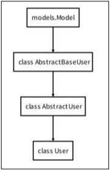

# Week15-2

-   Django - Cookie and Session & Authentication System


<link rel="stylesheet" href="../../assets/stylesheets/my_style.css">

<br>[Parent Contents...](../../README.md/#til-today-i-learned)


## Contents
- [sample](#sample)

<br>


-----


## Introduction

- HTTP : HTML 문서와 같은 리소스들을 가져올 수 있도록 해주는 규약, 웹(WWW)에서 이루어지는 모든 데이터 교환의 기초
  + 비 연결 지향(connectionless) - 서버는 요청에 대한 응답을 보낸 후 연결을 끊음
  + 무상태(stateless) - 연결을 끊는 순간 클라이언트와 서버 간의 통신이 끝나며 상태 정보가 유지되지 않음

- 무상태로 인한 문제
  + 장바구니에 담은 상품 유지 X
  + 로그인 상태 유지 X


-----


## Cookie

- 쿠키 ( Cookie ) : 서버가 사용자의 웹 프라우저에 전송하는 작은 데이터 조각
  + 클라이언트 측에 저장되는 작은 데이터 파일, 사용자 인증, 사용자 추적, 상태 유지 등에 사용됨

- 사용 예시
  + 브라우저(클라이언트)는 쿠키를 로컬에 KEY-VALUE의 데이터 형식으로 저장
  + 쿠키를 저장해 두고, 동일한 서버에 재요청 시 저장된 쿠키를 함께 전송

- 사용 목적
  + 세션 관리 (Session management) - 로그인, 아이디 자동완성, 공지 하루 안 보기, 팝업 체크, 장바구니 등의 정보 관리
  + 개인화 (Personalization) - 사용자 선호, 테마 등의 설정
  + 트래킹 (Tracking) - 사용자 행동을 기록 및 분석

- 세션 ( Session ) : 서버 측에서 생성되어 클라이언트와 서버 간의 상태를 유지, 상태 정보를 저장하는 데이터 저장 방식

- 쿠키 종류별 Lifetime(수명)
  + Session cookie
    * 현재 세션(current session)이 종료되면 삭제됨
    * 브라우저 종료와 함꼐 세션이 삭제됨
  + Persistent cookies
    * Expires 속성에 지정된 날짜 혹은 Max-Age 속성에 지정된 기간이 지나면 삭제됨

- In Django
  + 'database-backed sessions' 저장 방식 사용
  + session 정보는 DB의 `django_session` 테이블에 저장
  + Django는 특정 session id를 포함하는 쿠키를 사용해서 각각의 브라우저와 사이트가 연결된 session을 알아냄
  + Django는 우리가 session 메커니즘(복잡한 동작원리)에 대부분을 생각하지 않겎므 도움을 줌


-----


## Django Authentication System

- Django Authentication System - 사용자 인증과 관련된 기능을 모아 놓은 시스템, 인증과 권한 부여를 함께 제공 및 처리

- Authentication (인증) : 사용자가 누구인지 확인하는 것, 신원 확인

- Authorization (권한, 허가) : 인증된 사용자가 수행할 수 있는 작업을 결정, 권한 부여

- 사전 설정
  + 두번째 app accounts 생성 및 등록

- Custome User model로 대체
  1. `accounts/models.py`에 AbstracUser를 상속 받는 커스텀 User 클래스 생성
  2. `crud/settings.py`에 `AUTH_USER_MODEL = 'accounts.User'` 추가, 수정 전 기본값은 'auth.User'
  3. `accounts/admin.py`에 `admin.site.register(User, UserAdmin)` 등록

### Login

- Login : Session을 Create하는 과정

- `AuthenticationForm()` - 로그인을 위한 built-in form

- `login(request, user)` - 인증된 사용자를 로그인 하는 함수

- `get_user()` - AuthenticationForm의 인스턴스 메서드
  + 유효성 검사를 통과했을 경우 로그인 한 사용자 객체를 반환

### Logout

- Logout : Session을 Delete하는 과정

- `logout(request)` 
  + 현재 요청에 대한 session data를 DB에서 삭제
  + 클라이언트의 쿠키에서도 sessionid를 삭제

## Template with Authentication data

- 템플릿에서 인증 관련 데이터를 출력
```html
<!-- articles/index.html -->

<h3>Hello, {{ user }}</h3>
```

- context processors
  + 템플릿이 렌더링 될 때 호출 가능한 컨텍스트 데이터 목록
  + django에서 자주 사용되는 데이터들 미리 템플릿에 로드해둔것
  + `{{ project }}/settings.py`
```py
# settings.py

TEMPLATES = [
  ...
  'OPTIONS': {
    'context_processors': [
      'django.template.context_processors.debug',
      'django.template.context_processors.request',
      'django.contrib.auth.context_processors.auth',
      'django.contrib.messages.context_processors.messages',
    ]
  }
]
```


-----


## Tips



- `AbstractUser` class
  + 관리자 권한과 함께 완전한 기능을 가지고 있는 User model을 구현하는 추상 기본클래스
  + Abstract base classes (추상 기본 클래스)
    * 몇 가지 공통 정보를 여러 다른 모델에 넣을 때 사용하는 클래스
    * DB 테이블을 만드는데 사용되지 않으며, 대신 다른 모델의 기본 클래스로 사용되는 경우 해당 필드가 하위 클래스의 필드에 추가
    > [Python abc - Abstract Base Classes](https://docs.python.org/3/library/abc.html)

- Custom User Model - 유저 대체하기
> [Django Customizing auth Manual](https://docs.djangoproject.com/en/3.2/topics/auth/customizing/#substituting-a-custom-user-model)