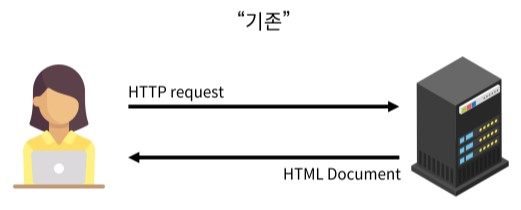
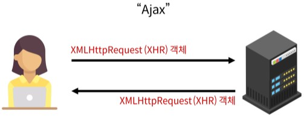

# Week17-3

-   Django - Improve query, Ajax


<link rel="stylesheet" href="../../assets/stylesheets/my_style.css">

<br>[Parent Contents...](../../README.md/#til-today-i-learned)


## Contents
- [sample](#sample)

<br>


-----


## Improve query

- Improve query - 같은 결과에 대해 쿼리 개수를 줄여 조회하기

- 전체 게시글에서 댓글 수 조회할때 SQL문이 낭비됨
  + 댓글 갯수를 전체 게시글에 붙여서 쿼리문 재호출을 줄임

- `annotate`
  + SQL의 GROUP BY절을 활용
  + 11 queries including 10 similar -> 1 query

- `select_related` - 1:1 또는 N:1 참조 관계에서 사용
  + SQL의 INNER JOIN 절을 활용
  + 11 quries including 10 similar and 8 duplicates -> 1 quries

- `prefetch_related` - N:N 또는 N:1 역참조 관계에서 사용
  + SQL이 아닌 Python을 사용한 JOIN이 진행


-----


## Ajax

- 비동기 ( Asynchronous ) : 작업을 시작한 후 결과를 기다리지 않고 다음 작업을 처리하는 것 (병렬적 수행)
  + 시간이 필요한 작업들은 요청을 보낸 뒤 응답이 빨리 오는 작업부터 처리
  + ex) 메일을 송신할때 화면은 목록으로 이동하지만 실제 송신 작업을 뒤에서 처리중임

```js
function slowRequest(callBack) {
  console.log('1. 오래 걸리는 작업 시작 ...')
  setTimeout(function () {
    callBack()
  }, 3000)
}

function myCallBack() {
  console.log('2. 콜백함수 실행됨')
}

slowRequest(myCallBack)
console.log('3. 다른 작업 실행')

// 출력결과
// 1. 오래 걸리는 작업 시작 ...
// 3. 다른 작업 실행
// 2. 콜백함수 실행됨
```

- Ajax ( Asynchronous JavaScript And XML ) - 비동기적인 웹 애플리케이션 개발을 위한 <span>프로그래밍 기술명</span>
  + 사용자 요청에 즉각적인 반응을 제공하면서 페이지 전체가 아닌 필요한 부분만 업데이트 후 로드하는 것이 목표




- XMLHttpRequest - JavaScript 객체로, 클라이언트와 서버 간에 데이터를 비동기적으로 주고받을 수 있도록 해주는 객체

### 비동기 요청

- Axios : JavaScript에서 HTTP 요청을 보내는 라이브러리, 주로 FE (프론트엔드) 프레임워크에서 사용

- 기본 문법
```js
<script src="https://cdn.jsdelivr.net/npm/axios/dist/axios.min.js"></script>
<script>
  axios({
    method: 'HTTP 메서드',
    url: '요청 URL',
  })
    .then(성공하면 수행할 콜백함수)
    .catch(실패하면 수행할 콜백함수)
</script>
```


-----


## Follow with Ajax

```py
from django.http import JsonResponse

@login_required
def follow(request, user_pk):
    User = get_user_model()
    you = User.objects.get(pk=user_pk)
    me = request.user

    if you != me:
        if me in you.followers.all():
            you.followers.remove(me)
            is_followed = False
        else:
            you.followers.add(me)
            is_followed = True
        context = {
            'is_followed': is_followed,
            'followings_count': you.followings.count(),
            'followers_count': you.followers.count(),
        }
        return JsonResponse(context)
    return redirect('accounts:profile', you.username)
```
```js
<script>
  const form = document.querySelector('#follow-form')
  const csrftoken = document.querySelector('[name=csrfmiddlewaretoken]').value

  form.addEventListener('submit', (event) => {
    event.preventDefault()

    const userId = event.target.dataset.userId

    axios({
      method: 'POST',
      url: `/accounts/${userId}/follow/`,
      headers: {'X-CSRFToken': csrftoken,}
    })
      .then((response) => {
        const isFollowed = response.data.is_followed
        const followBtn = document.querySelector('#follow-form > input[type=submit]')
        if (isFollowed === true) {
          followBtn.value = 'Unfollow'
        } else {
          followBtn.value = 'Follow'
        }
        const followingsCountTag = document.querySelector('#followings-count')
        const followersCountTag = document.querySelector('#followers-count')
        const followingsCountData = response.data.followings_count
        const followersCountData = response.data.followers_count
        followingsCountTag.textContent = followingsCountData
        followersCountTag.textContent = followersCountData
      })
  })
</script>
```


-----


## Dotenv

- Python-dotenv 활용하여 환경 변수 관리

- `pip install python-dotenv`

- .env -> `SECRET_KEY = 'SECRET_KEY 생성기를 통해 생성한 값'`

- settings.py -> 
```py
# 기존
SECRET_KEY = '기존 SECRET_KEY'

# ------------------------

# 수정
import os
from dotenv import load_dotenv

"""
load_dotenv()
.env 파일의 key-value를 프로그램 환경 변수에 등록
"""
load_dotenv()


"""
환경 변수에서 key가 SECRET_KEY인 value 불러오기
"""
SECRET_KEY = os.getenv('SECRET_KEY')
```


-----


## 클라우드 타입
  
- 클라우드 타입 : 클라우드 서비스 중 PaaS 타입 서비스
  + PaaS ( Platform as a Service ) : 환경이 조금 갖춰진 클라우드 서비스
  > ex) Django, Git 등 존재
  + IaaS (  ) : 환경이 구축되지 않은 클라우드 서비스
  + SaaS (  ) : 모든 환경이 준비된 클라우드 서비스

- 환경 변수 설정 기능 제공