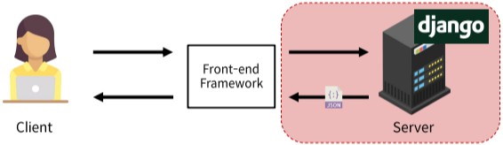
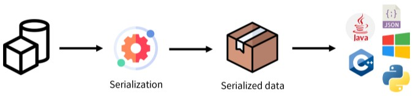
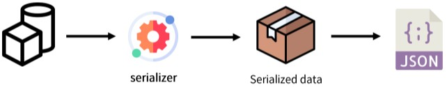
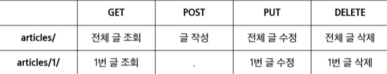

# Week18-1

-   Django - Rest Framework

<link rel="stylesheet" href="../../assets/stylesheets/my_style.css">

 [Parent Contents...](../../README.md/#til-today-i-learned)

## Contents
- [sample](#sample)

 

-----

## Outline

- HTTP Request Methods : 리소스에 대한 행위를 정의, HTTP verbs라고도 함
  + GET - 서버에 리소스의 표현을 요청, 데이터 검색만 해야함
  + POST - 데이터를 지정된 리소스에 제출, 서버의 상태 변경
  + PUT - 요청한 주소의 리소스를 수정
  + DELETE - 지정된 리소스를 삭제

- HTTP response status codes
  + Informational responses (100-199)
  + Successful responses (200-299)
  + Redirection messages (300-399)
  + Client error responses (400-499)
  + Server error responses (500-599)
  > https://http.cat/

-----

## RESE API

- API ( Application Programming Interface ) : 애플리케이션과 프로그래밍으로 소통하는 방법
  + API는 복잡한 코드를 추상화하여 대신 사용할 수 있는 몇가지 더 쉬운 구문을 제공

- Web API : 웹 서버 또는 웹 브라우저를 위한 API
  + Open API를 활용하는 추세
  + 대표적인 Third Party Open API - YoutubeAPI, Naver Papago API, Kakao Map API
  + API는 HTML, JSON 등 다양한 타입의 데이터를 응답

- REST ( Representational State Transfer ) : API Server를 개발하기 위한 일종의 소프트웨어 설계 방법론
  + 소프트웨어 아키텍쳐 디자인 제약 모음
  + 자원을 정의하고 자원에 대한 주소를 지정하는 전반적인 방법을 서술

- 주소를 지정하는 방법
  1. 자원의 식별 - URI
  2. 자원의 행위 - HTTP Methods
  3. 자원의 표현 - 궁극적으로 표현되는 결과물, JSON으로 표현된 데이터 제공

- REST API : REST라는 API 디자인 아키텍처를 지켜 구현한 API

-----

## Response JSON

- Django는 더이상 Template 부분에 대한 역할을 담당하지 않게 되며 Front-end와 Back-end가 분리되어 구성되게 됨

- DRF ( Django REST framework ) : Django에서 Restful API 서버를 쉽게 구축할 수 있도록 도와주는 오픈소스 라이브러리
> https://www.django-rest-framework.org/

-----

## Serialization

- Serialization (직렬화) : 여러 시스템에서 활용하기 위해 데이터 구조나 객체 상태를 나중에 재구성할 수 있는 포맷으로 변환하는 과정

-----

## DRF - Single Model

- ModelSerializer : 모델 필드에 해당하는 필드가 있는 Serializer 클래스를 자동으로 만듦
  + Model 정보에 맞춰 자동으로 필드를 생성
  + serializer에 대한 유효성 검사기를 자동으로 생성
  + .create() 및 .update()의 기본 구현 메서드가 포함됨

- URL과 HTTP requests methods 설계

- GET
  + 게시글 리스트 및 단일 게시글 조회하기
  + 조회 성공 시 200 ok, 존재하지 않는 데이터 참조 시 500 Internal Server Error

- `api_view` decorator
  + DRF view 함수가 응답해야 하는 HTTP 메서드 목록을 받음
  + 기본적으로 GET 메서드만 허용되며 다른 메서드 요청에 대해서는 405 Method Not Allowed로 응답
  + DRF view 함수에서 필수

- POST
  + 게시글 데이터 생성하기
  + 생성 성공 시 201 Created 상태 코드 응답, 실패 했을때는 400 Bad request
  + decorator에 'POST' 추가

- `raise_exception`
  + is_valid()는 유효성 검사 오류가 있는 경우 ValidationError 예외를 발생시키는 선택적 raise_exception 인자를 사용할 수 있음
  + DRF에서 제공하는 기본 예외 처리기에 의해 자동으로 처리되며 기본적으로 HTTP 400 응답을 반환

- DELETE
  + 게시글 데이터 삭제
  + 요청에 대한 데이터 삭제가 성공했을 경우 204 No Content 상태 코드 응답

- PUT
  + 게시글 데이터 수정
  + 요청에 대한 성공으로 200 OK 상태 코드 응답