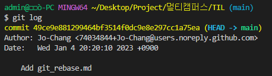
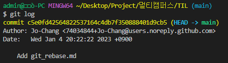

<!--
ref) https://devhealer.tistory.com/53
-->

1.  `$git log`
    - commit log 확인

2.  `$git rebase -i {hash}`
    - 수정하고 싶은 날짜의 commit hash 복사
    - `$git rebase -i --root`로 작동

3.  `$git commit --amend --no-edit --date="{조작하고 싶은 날짜}"
    - 날짜 형식 : {Sun 1 Mar 2020 20:11:22 KST}
    - 날짜 지정

4.  `$git rebase -- continue`
    - rebase 진행

5.  `git push -f origin master`
    - 강제 푸쉬(-f option)을 사용해 수정한 rebase 내용 등록

**본 md파일은 실시간 20분에 commit하여 22분으로 등록될 예정임

결과 확인)
commit id :  2681ca48937ef0f36a7e31a4a4a815c8f528936b ->        
            c5e0fd42564822537164c4db7f350888401d9cb5
로 변화

-   수정 전

 :arrow_down_small: 
-   수정 후
