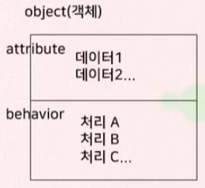

# Python Class & OOP

<style>
    span {color:#FF5353;}
</style>

## Programming Paradigm

-   절차적 프로그래밍 ( Procedure Programming )
    +   작업의 처리절차 및 과정을 중시하는 프로그래밍
    +   업무를 최적의 알고리즘이나 로직에 의거해 단계적인 절차에 따라 처리
    +   구조체 자료형이나 함수를 구현해 프로그램을 구조화
    +   <span>단점</span>
        *   자료(데이터)와 함수가 서로 분리
        *   데이터가 여기저기 산재해 혼동 발생
        *   프로그램 작성이 비교적 쉽지만 크기가 커질수록 혼동이 커짐
    +   <span style="color:#5353FF;">장점</span>
        *   메모리 공간이나 처리속도는 유리
<br><br>

-   객체지향 프로그래밍 ( Object Oriented Programming )
    +   프로그램의 요소들을 실세계에서의 객체로 모델링하여 객체간의 상호작용방식으로 프로그래밍 하는 기법
    +   실세계의 사물과 같이 attribute(속성), behavior(행동)을 가지고 있음
        *   Attribute : 객체의 상태나 특징을 묘사하는 요소 (variable, member)
        *   Behavior : 객체의 행동이나 기능적인 요소 (function, method)

        


## OOP

-   객체지향 프로그래밍 ( Object Oriented Programming )
-   특징
    +   추상화 ( abstraction ) : 현실세계의 물체나 작업을 객체로 표현할 때, 문제의 중요한 측면만 강조 하는 것
    +   캡슐화 ( encapsulation ) : 데이터와 처리루틴을 하나로 패키징 하는 것
    +   상속성 ( inheritance ) : 어떤 클래스가 다른 클래스의 속성과 메서드를 물려 받는 것. 코드 재사용
    +   다형성 ( polymoriphism ) : 서로 다른 여러 오브젝트가 하나의 동일한 메서드에 대해 각 오브젝트의 특징을 담아 다르게 반응하는 것


## Class

-   클래스 ( Class ) : 객체의 설계도
-   오브젝트 ( Object ) : 객체의 생성물(인스턴스), 클래스가 실체화 된 상태
-   클래스의 정의와 생성
    ```python
    class ClassName:

        def 함수명(self, 인자...)
        ....
    ```

-   Self 키워드
    +   클래스 정의 시 모든 함수(메서드)의 <span>첫번째 인자</span>는 반드시 self이다.
    +   객체 자신의 참조를 의미
    +   self를 통해 클래스 내의 변수나 함수에 접근 가능

-   생성자 ( constructor, initializer ) : 객체가 생성될때 저절로 수행되는 메서드(함수)
    +   __init__ 이름으로 정의한다.
    ```python
    class Sample:
        def __init__(self):
            self.value = 0
        def get(self):
            return self.value
        def set(self, val):
            self.value = val
    ```

-   접근 지정자
    +   public : 허용, default
    +   private : 불허(정보은닉) {`__name`}이나 {`_name`} 사용
    +   protected : 상속관계에서 자식에게만 허용

-   Python 클래스 변수 문제점
    ```python
    class Hello:
        def __init__(self):
            self.__count = 0

    ...

    h1.sss = "korea"
    h1.bbb = "America"
    print(h1.sss, h1.bbb) # korea America 정상적으로 추가됨

    # print(h1.__count) # 할당 없이 접근하면 AttributeError
    h1.__count = 20000
    print(h1.__count)       # 20000
    print(h1.showCount())   # 6
    # 클래스 밖에서 private 변수에 접근하면 해당 private 변수가 아닌 다른 변수로 인식
    ```

-   멤버변수 고정하기
    +   __slots__를 이용하여 사용할 멤버를 미리 등록
    +   새로운 속성에 접근 시 에러 발생
    ```python
    class Hello:
        __slots__ = ["__count"]
        def __init__(self):
            self.__count = 0

    h1.sss="korea"  # Traceback AttributeError  
    # __slots__가 없다면 정상적으로 추가됨..
    h1.__count = 20000
    print(h1.count)
    print(h1.showCount())
    ```

-   클래스 변수와 인스턴스 변수
    +   클래스 멤버변수
        *   클래스 네임스페이스에 생성
        *   모든 인스턴스 객체에 공유
        *   동적 추가 가능
        ```python
        class Test:
            number = 0

            def __init__(self):
                Test.number += 1
                self.name = str(Test.number)+"번 인스턴스"
            
        if __name__ == "__main__":
            a = Test()
            b = Test()
            c = Test()
            d = Test()

            print(a.name)   # 1번 인스턴스
            print(b.name)   # 2번 인스턴스
            print(c.name)   # 3번 인스턴스
            print(d.name)   # 4번 인스턴스
        ```
    
    +   인스턴스 멤버변수
        *   해당 인스턴스 네임스페이스에 생성
        *   해당 인스턴스 객체 내에서만 참조
        *   동적 추가 가능
        ```python
        class Test:
            number = 0

            def __init__(self):
                self.number += 1
                self.name = str(self.number)+"번 인스턴스"
            
        if __name__ == "__main__":
            a = Test()
            b = Test()
            c = Test()
            d = Test()

            print(a.name)   # 1번 인스턴스
            print(b.name)   # 1번 인스턴스
            print(c.name)   # 1번 인스턴스
            print(d.name)   # 1번 인스턴스
        ```

    +   클래스와 인스턴스 변수 동적 추가
        ```python
        class Sample:
            data = 100
        
        print(Sample.data)  # 100

        Sample.word = "Python"
        print(Sample.word)  # Python

        s = Sample()
        s.data  # 100
        s.word  # Python

        s2 = Sample()
        s2.data # 100
        s2.word # Python

        s2 = Sample()
        s2.string = "Hello Python"
        s3 = Sample()
        s3.string   # AttributeError : 'Sample' object has no attribute 'string'
        ```