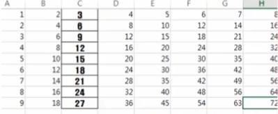

# Python Excel


## openpexl

-   파이썬에서 엑셀처리를 할 수 있는 파이썬 외부 라이브러리
-   Excel 2010 이상의 xlsx, xlsm, xltx, xltm 파일 처리 가능
-   Anaconda 배포본에 포함되어 있음


-----


## Process

1.  openpyxl 모듈 import
```python
import openpyxl
```

2.  워크북을 열어서 핸들러를 얻는다.
```python
wb = openpyxl,load_workbook('test2.xlsx')   # 기존
wb = openpyxl.Workbook()                    # 신규, 기존 파일 존재 시 내용 삭제 됨 
```

3.  워크시트의 핸들러를 얻는다.
```python
sh = wb.active  # 활성시트
sh = get_sheet_by_name('sheet1')    # 명시적 이름으로
```

4.  시트의 cell(행, 열)을 이용하여 넣고 빼는 작업한다.
```python
sh.cell(r,c).value = "우리나라"
sh['A3'] = "대한민국"
sh(cell(r, c, "파이썬"))
```


-----


## Execute

-   Hello cell 만들기

```python
from openpyxl import *
from openpyxl.styles import Alignment, Font, Border, Side

wb = Workbook()
ws = wb.active
ws['B3'] = "Hello"
ws['B3'].font = Font(
    name="HY헤드라인M",
    bold=True,
    size=20,
    italic=True,
    underline='single'
    )
ws['b3'].alignment = Alignment(horizontal='center', vertical='venter')
th=Side(border_style='thin')
db=Side(border_style='double')
ws['b3'].border = Border(top=th, bottom=th, left=db, right=db)

wb.save("BoldDemo.xlsx")
```


-----


## 주요 작업

-   모든 행을 대상으로 작업
    +   sheet 객체 rows 이용(generator 객체로서 행들로 구성되어 있음)
    ```python
    for rw, data in enumerate(sh.rows):
        print(rw, data[0].value, data[1].value)
    ```

    +   sheet 객체 max_row이용(행의 최대 인덱스값)
    ```python
    for i in rangE(1, sh.max_row+1):
        point = "A" + str(i)
        print(sh[point].value)
    ```

    +   sheet 객체 columns 이용(generator 객체로서 열들로 구성되어 있음)
    ```python
    for line in sh.clumns:
        for col in line:
            print(col.value)
        print("----------------")
    ```

    +   특정 셀집합에 대한 선택적 작업(슬라이싱)
    ```python
    m_cell = sh['c1':'e7']
    for onerow in m_cell:
        for onecell in onerow:
            print(onecell.value)
    ```

    +   column과 row의 선택적 작업
    ```python
    from openpyxl import *
    from openpyxl.styles import Alignment, Font, Border, Side
    
    wb = Workbook()
    ws = wb.active

    for i in range(1, 10):
        for j in range(1, 10):
            ws.cell(i, j, i*j)
    
    c = ws['c']
    for col in c:
        col.font = Font(name="HY헤드라인M", bold=True)
        col.alignment=Alignment(horizontal="center", vertical="center")
        th = Side(border_style="thin")
        col.border = Border(top=th, bottom=th, left=th, right=th)

    wb.save("BoldDemo.xlsx")
    ```

    

    +   행단위, 열단위 슬라이싱
    ```python
    # 열단위
    col_range = sh["b:c"]

    for data in col_range:
        for ele in data:
            print(ele.value)
    '''
    010-1234-5678
    010-3365-2148
    ...
    상계동 237
    삼성동 699
    ...
    '''
    ```
    ```python
    # 행단위
    row_range = sh[6:7]

    for data in row_range:
        for ele in data:
            print(ele.value)

    '''
    한희훈
    010-1234-5677
    시흥동 522
    ...
    지동석
    010-2202-4063
    영등포 434
    ...
    '''
    ```

    +   값만 활용 value속성
    ```python
    for r in sh.values:
        for c in r:
            print(c)
    
    '''
    김인문
    010-1234-5678
    상계동 237
    ...
    박동신
    010-4456-9898
    역삼동 855
    ...
    ...
    '''
    ```

    +   행, 열의 추가 및 삭제 메서드
    ```python
    # (시작, 개수)
    sh.insert_rows(5)
    sh.insert_cols(2,3)
    sh.delete_rows(2,2)
    sh.delete_cols(5,2)
    ```

    +   셀병합
    ```python
    sh.merge_cells("A1:b2")
    ```

    +   새로운 시트 추가
    ```python
    ws1 = wb.create_sheet("newsheet1")  # 마지막 시트 뒤에
    ws2 = wb.create_sheet("newsheet2", 0) # 맨 앞에
    ```