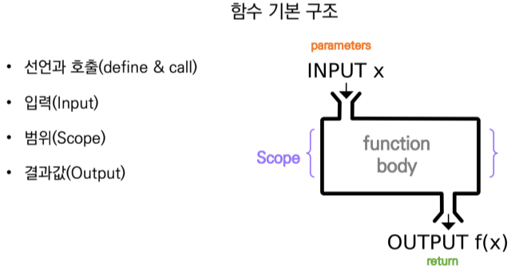

# Week02-3

## Contents
- [반복문 while](#반복문-while)
- [함수](#함수)
- [내장 함수](#내장-함수)
  * [map(function, iterable)](#map)
---
### 반복문 while
-   조건식이 참인 경우 반복적으로 코드 실행
```
while <expression>:
    # Code block
```

---

### 함수
-   특정한기능을 하는 코드의 조각(묶음)
-   필요 시에만 호출하여 재사용
-   *추상 ( Abstraction )
    - 복잡한 내용을 숨기고, 기능에 집중 ( 블랙박스 )
    - 사물이 지니고 있는 여러 가지 측면 가운데서 특정한 측면 포착
-   사용자 함수 ( Custom Function )
```
def function_name
    # code block
    return returning_value
```


---

### 내장 함수
-   python에 기본적으로 탑재되어 있는 함수
> ex) print(), len(s), sum(iterable, start=0), max(iterable), min(iterable)
<br>수학) abs(x), divmod(a, b), pow(base, exp, mod=None), round(number, ndigit=None)
<br>논리) all(iterable), any(iterable)
<br>기타) bin(x), hex(x), oct(x), ord(c), chr(i)

#### map
-   map(function, iterable)
-   순회 가능한 데이터구조(Iterable)의 모든 요소에 함수 적용하고, map object로 반환